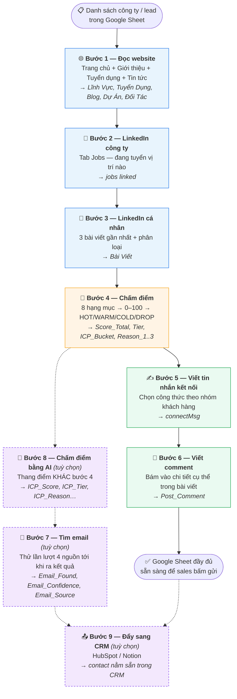

# Hệ thống tìm & làm giàu khách hàng tiềm năng — Bản giải thích dễ hiểu

> **Dành cho:** Sales, Marketing, Quản lý, người vận hành — **không cần biết lập trình.**
> **Bản kỹ thuật:** xem `SPECS.md` (dành cho dev).
> **Thời gian đọc:** ~20 phút. Đọc mục 1–4 là đã hiểu 80%.

---

## Mục lục

|     | Mục                                                                                                        | Đọc khi nào         |
| --- | ---------------------------------------------------------------------------------------------------------- | ------------------- |
| 1   | [Hiểu dự án trong 1 phút](#1-hiểu-dự-án-trong-1-phút)                                                      | Đọc đầu tiên        |
| 2   | [Nó thay bạn làm những việc gì](#2-nó-thay-bạn-làm-những-việc-gì)                                          | Muốn biết giá trị   |
| 3   | [Nguyên liệu vào — Thành phẩm ra](#3-nguyên-liệu-vào--thành-phẩm-ra)                                       | Chuẩn bị chạy       |
| 4   | [⭐ Câu chuyện của một khách hàng tiềm năng](#4--câu-chuyện-của-một-khách-hàng-tiềm-năng-ví-dụ-xuyên-suốt) | **Quan trọng nhất** |
| 5   | [Toàn cảnh 6 bước + 3 bước mở rộng](#5-toàn-cảnh-6-bước--3-bước-mở-rộng)                                                                    | Muốn nhìn tổng thể  |
| 6   | [Chi tiết từng bước](#6-chi-tiết-từng-bước)                                                                | Khi vận hành thật   |
| 7   | [Bảng chấm điểm khách hàng](#7-bảng-chấm-điểm-khách-hàng-icp)                                              | Muốn hiểu điểm số   |
| 8   | [File Google Sheet sẽ trông như thế nào](#8-file-google-sheet-của-bạn-sẽ-trông-như-thế-nào)                | Trước/sau khi chạy  |
| 9   | [Ba cách sử dụng](#9-ba-cách-sử-dụng-hệ-thống)                                                             | Chọn cách phù hợp   |
| 10  | [Máy làm tốt gì, làm dở gì](#10-máy-làm-tốt-gì-làm-dở-gì-kỳ-vọng-cho-đúng)                                 | Để không thất vọng  |
| 11  | [Câu hỏi thường gặp](#11-câu-hỏi-thường-gặp)                                                               | Khi thắc mắc        |
| 12  | [Gặp lỗi thì làm gì](#12-gặp-lỗi-thì-làm-gì-dịch-lỗi-sang-tiếng-người)                                     | Khi hỏng            |
| 13  | [Từ điển thuật ngữ](#13-từ-điển-thuật-ngữ)                                                                 | Gặp từ lạ           |
| 14  | [Checklist vận hành](#14-checklist-vận-hành-hàng-tuần)                                                     | Làm định kỳ         |
| 15  | [Chọn nhà cung cấp AI / Email / CRM](#15-chọn-nhà-cung-cấp-ai--email--crm)                                  | Khi muốn đổi dịch vụ |
| 16  | [Theo dõi trạng thái lead](#16-theo-dõi-trạng-thái-lead)                                                    | Khi đã bắt đầu gửi  |

> 🆕 **Cập nhật 20/08/2026.** Hệ thống vừa có thêm 3 việc mới (tìm email · chấm điểm bằng AI · đẩy sang CRM), khả năng **đổi nhà cung cấp AI** thay vì chỉ DeepSeek, và **yêu cầu đăng nhập** khi gọi qua server. Mục 15 và 16 là phần mới; các bước 7–9 ở mục 5–6 cũng là phần mới.

---

## 1. Hiểu dự án trong 1 phút

Hãy hình dung bạn thuê **một trợ lý sales cực kỳ chăm chỉ, làm việc 24/7, không bao giờ chán**.

Bạn giao cho trợ lý này một tờ giấy ghi: _"Tìm giúp tôi các công ty fintech ở Singapore"_ — hoặc đưa thẳng một danh sách công ty có sẵn.

Trợ lý sẽ tự động:

```
🔍  Tìm ra danh sách công ty phù hợp
        ↓
🌐  Vào website từng công ty, đọc trang Giới thiệu, Tuyển dụng, Tin tức
        ↓
💼  Vào LinkedIn công ty xem họ đang tuyển vị trí gì
        ↓
👤  Vào LinkedIn của sếp công ty đó, đọc 3 bài viết gần nhất họ đăng
        ↓
🧮  Chấm điểm: công ty này đáng theo đuổi không? (0–100 điểm)
        ↓
✍️  Viết sẵn tin nhắn kết nối + comment để thả dưới bài viết của họ
        ↓
📊  Điền tất cả vào file Google Sheet của bạn
```

**Kết quả:** sáng mai bạn mở Google Sheet lên, mỗi dòng là một khách hàng tiềm năng đã được nghiên cứu kỹ, chấm điểm, và có sẵn câu mở lời cá nhân hoá.

> **Một câu tóm tắt:** Hệ thống này biến _"tôi có một danh sách công ty"_ thành _"tôi biết nên gọi ai trước, và nói gì với họ"_.

---

## 2. Nó thay bạn làm những việc gì

### Trước đây — làm tay

Với **mỗi một** khách hàng tiềm năng, một bạn sales phải:

| #   | Việc phải làm                                    | Thời gian                   |
| --- | ------------------------------------------------ | --------------------------- |
| 1   | Mở website công ty, đọc trang Giới thiệu         | 3 phút                      |
| 2   | Tìm trang Tuyển dụng xem họ đang cần người gì    | 2 phút                      |
| 3   | Đọc trang Tin tức/Blog xem gần đây họ làm gì     | 3 phút                      |
| 4   | Lên LinkedIn tìm công ty, xem tab Jobs           | 2 phút                      |
| 5   | Tìm LinkedIn cá nhân của sếp/CTO                 | 3 phút                      |
| 6   | Đọc vài bài viết gần nhất của người đó           | 4 phút                      |
| 7   | Tự đánh giá "công ty này có đáng theo không"     | 2 phút                      |
| 8   | Nghĩ và viết tin nhắn kết nối cá nhân hoá        | 5 phút                      |
| 9   | Nghĩ một comment thông minh để thả dưới bài viết | 4 phút                      |
|     | **TỔNG**                                         | **~28 phút / 1 khách hàng** |

→ **100 khách hàng = khoảng 47 giờ làm việc** ≈ **6 ngày công**.

### Bây giờ — máy làm

| #   | Việc                                            | Máy làm                            |
| --- | ----------------------------------------------- | ---------------------------------- |
| 1–3 | Đọc website (Giới thiệu + Tuyển dụng + Tin tức) | ✅ Tự động                         |
| 4   | LinkedIn công ty → danh sách vị trí đang tuyển  | ✅ Tự động                         |
| 5   | Tìm LinkedIn cá nhân của sếp                    | ✅ Tự động (qua Google)            |
| 6   | Đọc 3 bài viết gần nhất                         | ✅ Tự động                         |
| 7   | Chấm điểm 0–100 + xếp loại NÓNG/ẤM/LẠNH/BỎ      | ✅ Tự động, nhất quán              |
| 8   | Viết tin nhắn kết nối                           | ✅ Tự động (AI)                    |
| 9   | Viết comment                                    | ✅ Tự động (AI)                    |
|     | **TỔNG**                                        | **~45–60 phút cho 100 khách hàng** |

**Việc bạn vẫn phải làm (máy không thay được):**

- Quyết định tiêu chí khách hàng lý tưởng là gì.
- **Đọc lại và duyệt** nội dung AI viết trước khi gửi.
- Bấm nút gửi kết nối, thả comment (máy chuẩn bị sẵn, người bấm gửi).
- Trò chuyện thật sự khi khách trả lời.

> 💡 **Cách hiểu đúng nhất:** hệ thống không thay thế sales. Nó xoá bỏ 90% việc _nghiên cứu và chuẩn bị_, để sales chỉ tập trung vào việc _nói chuyện với người_.

---

## 3. Nguyên liệu vào — Thành phẩm ra

### 3.1. Bạn cần đưa vào (chọn 1 trong 3)

| Cách                            | Bạn đưa gì                         | Ví dụ                                           |
| ------------------------------- | ---------------------------------- | ----------------------------------------------- |
| **A. Chỉ có ý tưởng**           | Địa điểm + Ngành nghề              | _"Singapore"_ + _"fintech"_                     |
| **B. Có sẵn danh sách công ty** | File Google Sheet có cột `website` | Bảng 200 công ty xuất từ đâu đó                 |
| **C. Có sẵn danh sách người**   | Google Sheet có cột `linkedUrl`    | Danh sách lead xuất từ LinkedIn Sales Navigator |

> Thực tế hay dùng nhất là **cách C** — xuất danh sách lead từ Sales Navigator, rồi để hệ thống làm giàu thêm thông tin.

### 3.2. Bạn nhận được

Tất cả đổ về **chính file Google Sheet đó**, thêm các cột mới:

| Nhóm                  | Cột mới                                          | Ý nghĩa                                             |
| --------------------- | ------------------------------------------------ | --------------------------------------------------- |
| **Về công ty**        | `Lĩnh Vực`                                       | Công ty này làm gì                                  |
|                       | `Tuyển Dụng`                                     | Đang tuyển vị trí nào (lấy từ website)              |
|                       | `jobs linked`                                    | Đang tuyển vị trí nào (lấy từ LinkedIn)             |
|                       | `Blog`                                           | 3 tin tức/bài viết gần nhất trên website            |
|                       | `Dự Án Gần Nhất`                                 | Sản phẩm/dự án mới nhất họ khoe                     |
|                       | `Đối Tác`                                        | Khách hàng/đối tác lớn họ nhắc tới                  |
| **Về con người**      | `Bài Viết`                                       | 3 bài LinkedIn gần nhất của lead (có link bấm được) |
| **Đánh giá**          | `Score_Total`                                    | Điểm 0–100                                          |
|                       | `Tier`                                           | HOT / WARM / COLD / DROP                            |
|                       | `ICP_Bucket`                                     | Thuộc nhóm khách hàng mục tiêu nào                  |
|                       | `Reason_1`, `Reason_2`, `Reason_3`               | **Vì sao** được điểm đó                             |
| **Nội dung sẵn dùng** | `connectMsg`                                     | Tin nhắn kết nối (< 300 ký tự)                      |
|                       | `Post_Comment`                                   | Comment để thả dưới bài viết của họ                 |
| **Đánh dấu**          | `Đã Crawl`, `Msg_Generated`, `Comment_Generated` | Ô tick ✅ — báo dòng này đã xử lý xong              |

**Nhóm cột mới (bổ sung 18–20/08/2026), chỉ có nếu bạn chạy các bước 7–9:**

| Nhóm                    | Cột mới                                              | Ý nghĩa                                                            |
| ----------------------- | ---------------------------------------------------- | ------------------------------------------------------------------ |
| **Email**               | `Email_Found`                                        | Email công việc tìm được                                           |
|                         | `Email_Confidence`                                   | Độ tin cậy 0–100 — **phải đọc kèm**, xem mục 6 bước 7              |
|                         | `Email_Source`                                       | Tìm được bằng nguồn nào (Hunter / Apollo / Snov / đoán theo mẫu)   |
| **Đánh giá bằng AI**    | `ICP_Score`, `ICP_Tier`, `ICP_Priority`              | Bảng điểm **thứ hai**, do AI chấm — khác `Score_Total` / `Tier`    |
|                         | `ICP_Reason`, `ICP_Approach`                         | Vì sao được điểm đó + một câu gợi ý cách tiếp cận                  |
| **Theo dõi bán hàng**   | `Lead_Status`, `Lead_Note`                           | Lead đang ở giai đoạn nào (xem mục 16)                             |

> ⚠️ **Đừng nhầm hai bảng điểm.** `Score_Total` / `Tier` là bảng điểm cũ (máy tính theo quy tắc, miễn phí). `ICP_Score` / `ICP_Tier` là bảng điểm mới do AI chấm, thang khác hẳn. Xem mục 7.5.

---

## 4. ⭐ Câu chuyện của một khách hàng tiềm năng (ví dụ xuyên suốt)

Đây là phần quan trọng nhất. Ta sẽ theo chân **một dòng duy nhất** trong Google Sheet, từ lúc trống trơn đến lúc sẵn sàng để sales bấm gửi.

### 🎬 Bối cảnh

Bạn xuất từ LinkedIn Sales Navigator ra một danh sách. Dòng số 7 trông như sau:

```
┌──────────────────────────────────────────────────────────────┐
│  fullName      : Sarah Tan                                   │
│  firstName     : Sarah                                       │
│  job_title     : Chief Technology Officer                    │
│  company_name  : FinPay Singapore                            │
│  country       : Singapore                                   │
│  employee_count: 420                                         │
│  industry      : Financial Services                          │
│  website       : https://finpay.sg                           │
│  flagship_url  : https://linkedin.com/company/finpay-sg      │
│  linkedUrl     : https://linkedin.com/in/sarahtan-fp         │
│  premium       : TRUE                                        │
│                                                              │
│  … và 12 cột nữa đang TRỐNG chờ máy điền                     │
└──────────────────────────────────────────────────────────────┘
```

Bạn chỉ biết Sarah là CTO của một công ty fintech Singapore. **Chưa biết gì để mở lời.**

---

### 🔹 Bước 1 — Máy đọc website `finpay.sg`

**Máy làm gì:** Mở website như một người dùng thật (dùng trình duyệt ẩn), rồi:

1. Đọc trang chủ.
2. **Tự tìm** các link như "Về chúng tôi", "Đội ngũ", "Careers", "Tin tức" — kể cả tiếng Việt lẫn tiếng Anh.
3. Đọc luôn những trang đó (tối đa 3 trang blog/tin tức).
4. Gộp tất cả nội dung lại, đưa cho AI đọc và tóm tắt.

**Kết quả điền vào 5 cột:**

| Cột              | Nội dung máy điền                                                                                                               |
| ---------------- | ------------------------------------------------------------------------------------------------------------------------------- |
| `Lĩnh Vực`       | `Fintech, Payment Infrastructure, B2B SaaS`                                                                                     |
| `Tuyển Dụng`     | `• Senior Data Engineer`<br>`• ML Engineer (NLP)`<br>`• Compliance Analyst`                                                     |
| `Blog`           | `• Ra mắt cổng thanh toán xuyên biên giới cho SME`<br>`• FinPay đạt chứng chỉ ISO 27001`<br>`• Hợp tác chiến lược với DBS Bank` |
| `Dự Án Gần Nhất` | `PayBridge — hệ thống đối soát giao dịch tự động, ra mắt Q1/2026`                                                               |
| `Đối Tác`        | `DBS Bank, Visa, Grab`                                                                                                          |

> 🧠 **Bạn vừa có gì:** biết công ty đang tuyển _Data Engineer_ và _ML Engineer_ → họ đang đầu tư vào AI/dữ liệu. Biết họ vừa hợp tác _DBS Bank_ → họ chơi ở sân enterprise. Đây chính là **chất liệu để mở lời**.

---

### 🔹 Bước 2 — Máy vào LinkedIn công ty xem tuyển dụng

**Máy làm gì:** Lấy link LinkedIn công ty, thêm đuôi `/jobs`, mở ra và đọc danh sách vị trí.

> 💰 Bước này máy **cố đọc trực tiếp trước, không dùng AI** — tiết kiệm chi phí. Chỉ khi đọc trực tiếp thất bại mới nhờ AI.

| Cột           | Nội dung                                                                                 |
| ------------- | ---------------------------------------------------------------------------------------- |
| `jobs linked` | `• Head of Data Platform`<br>`• Senior Backend Engineer (Payments)`<br>`• Data Engineer` |

> 🧠 **Bạn vừa có gì:** họ đang tuyển cả **Head of Data Platform** — vị trí cấp trưởng bộ phận. Đây là tín hiệu rất mạnh: công ty đang xây đội dữ liệu nghiêm túc, có ngân sách.

---

### 🔹 Bước 3 — Máy đọc 3 bài viết gần nhất của Sarah trên LinkedIn

**Máy làm gì:** Vào trang hoạt động của Sarah, đọc 3 bài gần nhất, và **phân biệt được 3 loại bài**:

| Loại                                  | Nghĩa là gì                                    | Dùng thế nào                                           |
| ------------------------------------- | ---------------------------------------------- | ------------------------------------------------------ |
| **Bài gốc** (type 1)                  | Sarah tự viết                                  | 🟢 Tốt nhất để comment — đây là quan điểm của chính họ |
| **Chia sẻ lại có bình luận** (type 3) | Sarah share bài người khác + thêm ý kiến riêng | 🟡 Vẫn tốt — phần ý kiến riêng là của họ               |
| **Chia sẻ lại đơn thuần** (type 2)    | Sarah chỉ bấm share, không viết gì             | 🔴 Yếu — comment vào đây dễ trượt                      |

**Kết quả trong ô `Bài Viết`:**

```
• [type:1(original)] [linkPost: https://linkedin.com/feed/update/urn:li:ugcPost:747485...]
  3mo: Sau 6 tháng, chúng tôi cắt được thời gian đối soát giao dịch từ 4 tiếng
  xuống 12 phút. Điều khó nhất không phải là model — mà là làm cho quy trình
  tự động sống sót qua vòng audit nội bộ...

• [type:3(repost+thought)] [linkPost: https://linkedin.com/feed/update/urn:li:ugcPost:741122...]
  1mo: Đúng điều chúng tôi đang gặp | Reshared: Báo cáo về AI governance trong ngân hàng...

• [type:2(repost)] [linkPost: https://linkedin.com/feed/update/urn:li:ugcPost:739001...]
  2mo: (Repost of MAS Singapore: Hướng dẫn mới về quản trị rủi ro AI)
```

> 🔗 Các đường link trong ô này **bấm được ngay trong Google Sheet** — máy tự bôi xanh và gạch chân. Bấm là mở thẳng bài viết.

> 🧠 **Bạn vừa có gì:** Sarah vừa nói về việc _"tự động hoá phải sống sót qua audit"_. Đây là chi tiết cực kỳ cụ thể — mở lời bằng chính điều này sẽ khác hẳn một tin nhắn chung chung.

---

### 🔹 Bước 4 — Máy chấm điểm

Máy chấm 8 hạng mục, cộng lại, ra điểm cuối:

| Hạng mục               | Điểm      | Vì sao                                                           |
| ---------------------- | --------- | ---------------------------------------------------------------- |
| 🌏 Vị trí địa lý       | **15**/15 | Singapore — thị trường trọng điểm                                |
| 👥 Quy mô              | **12**/15 | 420 nhân sự — cỡ vừa, đủ lớn để có ngân sách                     |
| 🏭 Ngành nghề          | **15**/15 | Financial Services — đúng ngành mục tiêu                         |
| 🏢 Loại hình           | **10**/10 | Công ty sản phẩm (không phải agency/outsourcing)                 |
| 🤖 Tín hiệu AI         | **15**/15 | Mô tả có "AI automation" + Blog có ML + đang tuyển Data Engineer |
| 🔧 Độ khớp dịch vụ     | **10**/10 | Có nhắc "đối soát", "compliance" — đúng thứ ta làm được          |
| 👔 Người ra quyết định | **20**/20 | Sarah là **CTO** — đúng người có quyền quyết                     |
| 💬 Mức độ hoạt động    | **5**/5   | Tài khoản Premium + có đăng bài gần đây                          |
|                        |           |                                                                  |
| ➕ Điểm cộng           | **+5**    | Đối tác có DBS Bank (+3), tin tuyển có "Head of" (+2)            |
| ➖ Điểm trừ            | **0**     | Không thiếu dữ liệu, không có dấu hiệu loại trừ                  |

**Kết quả:**

```
Score_Total  : 100
Tier         : 🔥 HOT
ICP_Bucket   : Enterprise AI Automation (ICP-A)
Reason_1     : C/VP tech: chief technology officer
Reason_2     : Primary market: Singapore (SG/HK)
Reason_3     : ICP-A industry: Financial Services
```

> 🧠 **Bạn vừa có gì:** một con số để **sắp xếp thứ tự ưu tiên**. Có 200 lead? Lọc cột `Tier` = HOT, làm 20 người đó trước.

---

### 🔹 Bước 5 — Máy viết tin nhắn kết nối

Máy tự nhận ra Sarah thuộc nhóm **ICP-A** (doanh nghiệp lớn, ngành tài chính) và **có bài viết** → chọn đúng công thức tương ứng, đưa nội dung bài viết của Sarah cho AI.

**Kết quả ô `connectMsg`:**

> _"Hi Sarah, your point about automation needing to survive internal audit really resonates — we see the same gap with SG/HK enterprise teams. The model is rarely the hard part. Open to connect and exchange notes?"_
>
> _(248 ký tự — dưới giới hạn 300 của LinkedIn)_

**Vì sao tin nhắn này tốt:**

| ✅ Có                                                    | ❌ Không có                                |
| -------------------------------------------------------- | ------------------------------------------ |
| Nhắc đúng chi tiết Sarah vừa viết ("sống sót qua audit") | Không quảng cáo dịch vụ                    |
| Đồng cảm bằng góc nhìn thị trường SG/HK                  | Không xin họp/xin call                     |
| Kết thúc bằng lời mời nhẹ nhàng                          | Không sáo rỗng kiểu "I'd love to connect!" |

---

### 🔹 Bước 6 — Máy viết comment để thả dưới bài viết

Đây là phần AI được huấn luyện kỹ nhất. AI đóng vai **một BD Executive 10 năm kinh nghiệm**, và bị cấm rất nhiều thứ:

| 🚫 AI **bị cấm**                                       | 💡 Lý do                            |
| ------------------------------------------------------ | ----------------------------------- |
| Nhắc tên công ty/sản phẩm nào (kể cả của mình)         | Comment quảng cáo bị người ta ghét  |
| Nhắc tên/công ty/địa điểm của Sarah                    | Nghe như bot đọc data               |
| Xin call, xin họp, xin kết nối                         | Comment không phải chỗ để bán hàng  |
| Khen sáo rỗng: _"Great post!"_, _"Thanks for sharing"_ | Ai cũng viết vậy, vô giá trị        |
| Tóm tắt lại bài viết                                   | Người viết biết họ viết gì rồi      |
| Dùng emoji, hashtag                                    | Trông thiếu chuyên nghiệp           |
| Trích nguyên văn bài viết                              | Phải diễn đạt lại bằng lời của mình |

Và AI **phải**: bám vào **một chi tiết cụ thể nhất** trong bài, viết 2–3 câu (30–60 từ), giọng tò mò khiêm tốn, và điều chỉnh góc quan tâm theo chức danh (với CTO thì hỏi về kỹ thuật, với CEO thì hỏi về chiến lược).

**Kết quả ô `Post_Comment`:**

> _"The jump from four hours to twelve minutes is striking, but the audit angle is what stuck with me. Curious how much of that timeline was rebuilding the pipeline versus getting the controls documented in a way reviewers accepted?"_

> 🧠 **Bạn vừa có gì:** một comment mà Sarah **có khả năng trả lời thật**, vì nó hỏi đúng thứ người trong nghề tò mò. Sarah trả lời = bạn đã có cuộc trò chuyện, trước cả khi gửi tin nhắn kết nối.

---

### 🏁 Dòng số 7 sau khi chạy xong

```
┌─────────────────────────────────────────────────────────────────────┐
│ Sarah Tan · CTO · FinPay Singapore                        🔥 HOT 100 │
├─────────────────────────────────────────────────────────────────────┤
│ Lĩnh vực    : Fintech, Payment Infrastructure, B2B SaaS             │
│ Đang tuyển  : Head of Data Platform, Data Engineer, ML Engineer     │
│ Tin mới     : Hợp tác DBS Bank · Đạt ISO 27001 · Ra mắt PayBridge   │
│ Đối tác     : DBS Bank, Visa, Grab                                  │
│ Bài viết    : 3 bài (1 bài gốc về tự động hoá đối soát) 🔗          │
│ Vì sao HOT  : CTO · Singapore · ngành tài chính                     │
│                                                                     │
│ 💬 Tin nhắn kết nối  : đã soạn sẵn (248 ký tự) ✅                    │
│ 💬 Comment bài viết  : đã soạn sẵn ✅                                │
└─────────────────────────────────────────────────────────────────────┘
```

**Sales chỉ còn 3 việc:** đọc lại nội dung → chỉnh vài chữ nếu muốn → bấm gửi.

⏱️ **Thời gian máy bỏ ra cho dòng này: khoảng 40 giây.** Thay vì 28 phút làm tay.

---

## 5. Toàn cảnh 6 bước + 3 bước mở rộng



**Bốn nhóm màu:**

- 🔵 **Thu thập** (bước 1–3) — máy đi đọc, tốn thời gian nhất
- 🟠 **Đánh giá** (bước 4) — máy tính điểm, chạy trong tích tắc, **không tốn tiền AI**
- 🟢 **Sáng tạo** (bước 5–6) — AI viết nội dung
- 🟣 **Mở rộng** (bước 7–9) — **mới, tuỳ chọn**, và **chỉ chạy được qua extension/server**, không có lệnh chạy tay

> 💡 **Thứ tự tiết kiệm nhất cho bước 7–9:** chấm điểm trước (bước 4 hoặc 8) → lọc lấy nhóm tốt → mới tìm email (bước 7, vì mỗi lượt tra email là tiền) → cuối cùng đẩy sang CRM (bước 9).

> 📌 **Các bước độc lập nhau.** Bạn có thể chỉ chạy bước 3 (lấy bài viết), hoặc chỉ chạy bước 6 (viết comment) nếu đã có sẵn bài viết từ trước. Không bắt buộc chạy hết.

---

## 6. Chi tiết từng bước

### 📘 Cách đọc bảng dưới đây

Mỗi bước có 6 dòng: **Máy làm gì** · **Cần chuẩn bị** · **Điền vào cột nào** · **Mất bao lâu** · **Tốn AI không** · **Hay hỏng chỗ nào**.

---

### Bước 1 — Đọc website công ty

|                      |                                                                                                                                                                                                             |
| -------------------- | ----------------------------------------------------------------------------------------------------------------------------------------------------------------------------------------------------------- |
| **Máy làm gì**       | Mở website bằng trình duyệt ẩn (để không bị chặn), đọc trang chủ, tự tìm và đọc thêm các trang "Về chúng tôi / Đội ngũ / Careers / Tin tức" (tối đa 3 trang tin), rồi đưa toàn bộ cho AI tóm tắt thành 5 ý. |
| **Cần chuẩn bị**     | Cột `website` có URL đầy đủ (có `https://`)                                                                                                                                                                 |
| **Điền vào cột**     | `Lĩnh Vực`, `Tuyển Dụng`, `Blog`, `Dự Án Gần Nhất`, `Đối Tác`                                                                                                                                               |
| **Mất bao lâu**      | 10–20 giây/công ty                                                                                                                                                                                          |
| **Tốn AI không**     | ✅ Có — 1 lượt gọi AI mỗi công ty                                                                                                                                                                           |
| **Hay hỏng chỗ nào** | Website chặn robot · Website toàn ảnh không có chữ · URL sai/chết → các cột để trống, không báo lỗi ầm ĩ                                                                                                    |

**Ví dụ nội dung cột `Blog` (giữ nguyên ngôn ngữ gốc, không dịch):**

```
• Ra mắt cổng thanh toán xuyên biên giới cho SME
• FinPay đạt chứng chỉ ISO 27001
• Hợp tác chiến lược với DBS Bank
```

---

### Bước 2 — LinkedIn công ty (tab Jobs)

|                      |                                                                                                                                                                     |
| -------------------- | ------------------------------------------------------------------------------------------------------------------------------------------------------------------- |
| **Máy làm gì**       | Lấy link LinkedIn công ty + thêm `/jobs`, mở ra, cuộn xuống để trang tải hết, rồi **đọc trực tiếp** danh sách vị trí. Chỉ khi đọc trực tiếp không ra gì mới nhờ AI. |
| **Cần chuẩn bị**     | Cột `flagship_url` chứa link LinkedIn công ty                                                                                                                       |
| **Điền vào cột**     | `jobs linked`                                                                                                                                                       |
| **Mất bao lâu**      | 15–30 giây/công ty                                                                                                                                                  |
| **Tốn AI không**     | ⚡ Thường **không** — chỉ dùng AI khi cần                                                                                                                           |
| **Hay hỏng chỗ nào** | LinkedIn bắt đăng nhập → không thấy job nào · Công ty không đăng job nào trên LinkedIn                                                                              |

> 💡 **Vì sao có 2 cột tuyển dụng?** `Tuyển Dụng` lấy từ **website** công ty, `jobs linked` lấy từ **LinkedIn**. Hai nguồn thường khác nhau — LinkedIn cập nhật hơn, website đầy đủ hơn.

---

### Bước 3 — LinkedIn cá nhân (bài viết)

|                      |                                                                                                                                                                           |
| -------------------- | ------------------------------------------------------------------------------------------------------------------------------------------------------------------------- |
| **Máy làm gì**       | Chuyển link profile thành link trang hoạt động, mở bằng phiên đăng nhập LinkedIn, đọc HTML để lấy chính xác **link + loại bài**, rồi đưa nội dung cho AI viết lại đầy đủ. |
| **Cần chuẩn bị**     | Cột `linkedUrl` + ⚠️ **cookie LinkedIn** (xem mục 11)                                                                                                                     |
| **Điền vào cột**     | `Bài Viết` (link bấm được), `Đã Crawl` (ô tick)                                                                                                                           |
| **Mất bao lâu**      | 20–40 giây/người                                                                                                                                                          |
| **Tốn AI không**     | ✅ Có — 1 lượt mỗi người                                                                                                                                                  |
| **Hay hỏng chỗ nào** | ⚠️ **Đây là bước dễ hỏng nhất.** Cookie hết hạn (~1 tháng) · LinkedIn chặn · Người đó không đăng bài bao giờ · Profile để riêng tư                                        |

**Nếu ô `Bài Viết` trống:** không phải lỗi hệ thống — thường là (a) cookie hết hạn, hoặc (b) người đó thật sự không đăng gì. Ô `Đã Crawl` sẽ **không** được tick, nên lần chạy sau máy tự thử lại.

---

### Bước 4 — Chấm điểm

|                      |                                                                                                                                                           |
| -------------------- | --------------------------------------------------------------------------------------------------------------------------------------------------------- |
| **Máy làm gì**       | Áp bảng điểm cố định (mục 7) lên dữ liệu đã thu được. Đây là **quy tắc cứng, không phải AI** — nên kết quả luôn giống nhau, giải thích được, và miễn phí. |
| **Cần chuẩn bị**     | Càng nhiều cột đã điền thì điểm càng chính xác                                                                                                            |
| **Điền vào cột**     | `ICP_Bucket`, `Score_Total`, `Tier`, `Reason_1`, `Reason_2`, `Reason_3`                                                                                   |
| **Mất bao lâu**      | Tức thì (dưới 1 giây cho cả nghìn dòng)                                                                                                                   |
| **Tốn AI không**     | ❌ **Không tốn đồng nào**                                                                                                                                 |
| **Hay hỏng chỗ nào** | Không hỏng, nhưng **thiếu dữ liệu = bị trừ điểm**. Công ty thiếu `industry` hoặc `description` bị trừ 5 điểm mỗi thứ.                                     |

> ⚠️ **Lưu ý quan trọng:** điểm thấp có thể vì công ty _không phù hợp_, cũng có thể chỉ vì _hệ thống chưa thu được đủ dữ liệu_. Luôn đọc cột `Reason_1..3` để biết lý do thật.

---

### Bước 5 — Viết tin nhắn kết nối

|                      |                                                                                                                                                         |
| -------------------- | ------------------------------------------------------------------------------------------------------------------------------------------------------- |
| **Máy làm gì**       | (1) Xác định lead thuộc nhóm ICP-A hay ICP-B. (2) Kiểm tra có bài viết chưa. (3) Chọn 1 trong 5 công thức. (4) Nhờ AI điền nội dung thật vào công thức. |
| **Cần chuẩn bị**     | `firstName`, `job_title`, `company_name`, `country` — và lý tưởng nhất là đã có `Bài Viết`                                                              |
| **Điền vào cột**     | `connectMsg`, `Msg_Generated` (ô tick)                                                                                                                  |
| **Mất bao lâu**      | 2–4 giây/người                                                                                                                                          |
| **Tốn AI không**     | ✅ Có — 1 lượt mỗi người                                                                                                                                |
| **Hay hỏng chỗ nào** | Không có bài viết → tin nhắn chung chung hơn (vẫn dùng được, nhưng kém sắc)                                                                             |

**5 công thức máy chọn giữa:**

| Nhóm                      | Có bài viết? | Giọng điệu                                                    |
| ------------------------- | ------------ | ------------------------------------------------------------- |
| ICP-A (doanh nghiệp lớn)  | ✅           | Bám vào chủ đề chuyển đổi số/tuân thủ trong bài của họ        |
| ICP-A                     | ❌           | Nói về khoảng cách tích hợp & quản trị của doanh nghiệp SG/HK |
| ICP-B (công ty công nghệ) | ✅           | Bám vào chủ đề AI/dữ liệu trong bài của họ                    |
| ICP-B                     | ❌           | Nói về lớp tích hợp làm team product mất thời gian            |
| Chưa rõ nhóm              | —            | Cá nhân hoá cơ bản theo tên/chức danh/công ty                 |

---

### Bước 6 — Viết comment

|                      |                                                                                                                                                                                      |
| -------------------- | ------------------------------------------------------------------------------------------------------------------------------------------------------------------------------------ |
| **Máy làm gì**       | Đọc nội dung ô `Bài Viết`, tìm **chi tiết cụ thể nhất** (một con số, một tên, một khẳng định), rồi viết 2–3 câu tò mò về đúng chi tiết đó — có điều chỉnh theo chức danh người đăng. |
| **Cần chuẩn bị**     | Ô `Bài Viết` phải có nội dung (ít nhất 30 ký tự)                                                                                                                                     |
| **Điền vào cột**     | `Post_Comment`, `Comment_Generated` (ô tick)                                                                                                                                         |
| **Mất bao lâu**      | 2–4 giây/người                                                                                                                                                                       |
| **Tốn AI không**     | ✅ Có — 1 lượt mỗi người                                                                                                                                                             |
| **Hay hỏng chỗ nào** | Không có bài viết → **máy bỏ qua, không gọi AI, không tốn tiền**, để ô trống                                                                                                         |

> 🆕 **Cập nhật 20/08/2026 — comment bớt giọng AI.** Luật viết đã được siết lại rất cụ thể: cấm dấu gạch ngang dài (—), cấm 13 từ mà AI hay dùng (_vibrant, crucial, pivotal, delve, showcase, foster, enhance…_), cấm liệt kê kiểu "X, Y và Z", cấm mở đầu sáo (_"Great post"_, _"Thanks for sharing"_, _"This resonates"_), cấm nịnh (_"Absolutely"_, _"Certainly"_), và bắt buộc câu dài ngắn xen kẽ thay vì đều đều. Mục tiêu: comment đọc như người gõ vội, không như máy viết.
>
> Cùng đợt này, bước 6 có thể chạy bằng **OpenRouter** thay cho DeepSeek (xem mục 15) — ở đó có model miễn phí.

**Comment được điều chỉnh theo chức danh:**

| Chức danh người đăng                   | AI sẽ tò mò về                                    |
| -------------------------------------- | ------------------------------------------------- |
| CEO / Founder                          | Tầm nhìn, định vị thị trường, "vì sao là lúc này" |
| CTO / VP Engineering / Head of Product | Cách làm kỹ thuật, đánh đổi khi triển khai        |
| Sales / BD / Partnerships              | Thị trường đón nhận ra sao, tác động tới đối tác  |
| Vận hành / Chương trình                | Thực tế vận hành, giới hạn nguồn lực              |
| Không rõ                               | Góc tò mò nghề nghiệp chung                       |

### Bước 7 — Tìm email công việc _(mới, tuỳ chọn)_

|                      |                                                                                                                                                                                                      |
| -------------------- | ---------------------------------------------------------------------------------------------------------------------------------------------------------------------------------------------------- |
| **Máy làm gì**       | Lấy tên người + tên miền công ty, rồi **thử lần lượt 4 nguồn**: Hunter.io → Apollo.io → Snov.io → tự đoán theo mẫu phổ biến (`ten@congty.com`, `ten.ho@congty.com`…) rồi gõ cửa máy chủ mail hỏi thử. |
| **Cần chuẩn bị**     | Cột tên (`fullName`) + cột tên miền (`domain`). Muốn dùng Hunter/Apollo/Snov thì cần **tài khoản trả phí của dịch vụ đó**; không có thì máy vẫn chạy bằng cách đoán.                                 |
| **Điền vào cột**     | `Email_Found`, `Email_Confidence`, `Email_Source`                                                                                                                                                     |
| **Mất bao lâu**      | 1–3 giây/người nếu dùng dịch vụ trả phí · **10–20 giây/người** nếu phải đoán (chờ máy chủ mail trả lời)                                                                                              |
| **Tốn AI không**     | ❌ Không dùng AI — nhưng **tốn credit** của Hunter/Apollo/Snov nếu bạn bật                                                                                                                            |
| **Hay hỏng chỗ nào** | Không có cột `domain` · Công ty dùng mail ẩn danh · Máy chủ mail từ chối trả lời (rất phổ biến) → cột để trống                                                                                       |

**Đọc cột `Email_Confidence` thế nào:**

| Điểm       | Nghĩa là                                                        | Nên làm gì                                             |
| ---------- | --------------------------------------------------------------- | ------------------------------------------------------ |
| **90–100** | Dịch vụ trả phí đã xác minh địa chỉ này có thật                 | Dùng được ngay                                         |
| **60–89**  | Máy chủ mail của công ty trả lời "địa chỉ này tồn tại"          | Khá chắc, gửi thử được                                 |
| **20–59**  | **Chỉ là đoán theo mẫu** — chưa ai xác nhận                     | ⚠️ Đừng gửi hàng loạt. Gửi thử 1 cái, hoặc bỏ qua      |
| _(trống)_  | Không tìm được                                                  | Bình thường — email công việc rất hay bị giấu          |

> 🔴 **Gửi email vào địa chỉ không tồn tại làm giảm uy tín tên miền của bạn** (tỉ lệ bounce cao → thư sau dễ vào spam). Cột `Email_Confidence` dưới 60 thì coi là "manh mối", không phải "địa chỉ".
>
> ⚠️ Hiện có một lỗi đã biết: **tên nước ngoài bị đảo họ/tên** (hệ thống mặc định họ đứng đầu theo kiểu Việt Nam). Với lead Singapore/Hong Kong, kết quả tra có thể sai nhiều — đã báo dev, xem `SPECS.md` mục 17.1 (B9).

---

### Bước 8 — Chấm điểm bằng AI _(mới, tuỳ chọn — khác bước 4)_

|                      |                                                                                                                                                                                     |
| -------------------- | ------------------------------------------------------------------------------------------------------------------------------------------------------------------------------------ |
| **Máy làm gì**       | Đưa toàn bộ thông tin lead (tên, chức danh, công ty, ngành, quy mô, bài viết gần nhất, mô tả LinkedIn) cho AI, kèm định nghĩa khách hàng mục tiêu, để AI tự chấm 0–100 và giải thích. |
| **Cần chuẩn bị**     | Các cột `fullName`, `title`, `company`, `industry`, `Bài Viết` càng đầy đủ càng tốt                                                                                                  |
| **Điền vào cột**     | `ICP_Score`, `ICP_Tier` (A/B/C/D), `ICP_Priority`, `ICP_Reason`, `ICP_Approach`                                                                                                      |
| **Mất bao lâu**      | 3–6 giây/người                                                                                                                                                                      |
| **Tốn AI không**     | ✅ **Có — 1 lượt gọi AI mỗi lead.** Bước 4 thì miễn phí, bước này thì không                                                                                                          |
| **Hay hỏng chỗ nào** | Chấm quá ~60 lead một lượt có thể bị Google Sheet chặn ghi giữa chừng (chạy lại là tiếp tục được) · Lead thiếu thông tin → AI chấm điểm thấp oan                                    |

**Thang điểm của bước 8 (khác hẳn bước 4):**

| Hạng mục                | Trần   | Ghi chú                                              |
| ----------------------- | ------ | ---------------------------------------------------- |
| 👔 Chức vụ / quyền quyết | **30** | C-level, Founder được điểm cao nhất                  |
| 🏭 Độ khớp ngành        | 25     |                                                      |
| 👥 Quy mô công ty       | 20     |                                                      |
| 💬 Mức hoạt động LinkedIn | 15   | Có đăng bài gần đây + tương tác tốt                  |
| 🔔 Tín hiệu mua         | 10     | Đang tuyển, mở rộng, gọi vốn, ra sản phẩm mới…       |

| Tier | Điểm   | `ICP_Priority` |
| ---- | ------ | -------------- |
| A    | ≥ 75   | High           |
| B    | 50–74  | High           |
| C    | 30–49  | Medium         |
| D    | < 30   | Low            |

> 📌 Bước 8 **không thay thế bước 4**. Hai bảng điểm nhìn vào hai thứ khác nhau — bước 4 nhìn **công ty**, bước 8 nhìn **con người**. Xem mục 7.5 để biết dùng cái nào.

---

### Bước 9 — Đẩy lead sang CRM _(mới, tuỳ chọn)_

|                      |                                                                                                                                                                       |
| -------------------- | ----------------------------------------------------------------------------------------------------------------------------------------------------------------------- |
| **Máy làm gì**       | Đọc sheet, chuyển mỗi dòng thành một contact, rồi đẩy sang **HubSpot** hoặc **Notion**. Có email trùng thì cập nhật contact cũ, chưa có thì tạo mới.                  |
| **Cần chuẩn bị**     | Token của HubSpot, hoặc token Notion + ID database. Với Notion, database phải có sẵn đúng các cột: Name, Email, Title, Company, Status, ICP Score, ICP Tier, LinkedIn, Notes |
| **Điền vào cột**     | Không ghi gì vào Sheet — kết quả nằm bên CRM                                                                                                                          |
| **Mất bao lâu**      | 1–2 giây/lead                                                                                                                                                         |
| **Tốn AI không**     | ❌ Không                                                                                                                                                              |
| **Hay hỏng chỗ nào** | ⚠️ **Chạy lại là đẩy lại toàn bộ** — không có ô tick đánh dấu "đã đẩy" · Lead **không có email** thì HubSpot tạo contact mới mỗi lần → bị nhân bản                    |

> 🔴 **Có một lỗi nghiêm trọng chưa sửa với Notion:** lead **không có email** sẽ **ghi đè lên một bản ghi có sẵn** trong database Notion (mất dữ liệu cũ). Trước khi chạy bước 9 với Notion: **lọc bỏ các dòng chưa có `Email_Found`**, và sao lưu database. Chi tiết ở `SPECS.md` mục 17.1 (B7).

---

## 7. Bảng chấm điểm khách hàng (ICP)

### 7.1. ICP là gì?

**ICP = Ideal Customer Profile = Chân dung khách hàng lý tưởng.**

Nói đơn giản: _"Khách hàng như thế nào thì hợp với ta nhất?"_

Hệ thống này được cấu hình cho **2 nhóm khách hàng**:

| Nhóm                             | Là ai                                                                                                           | Vấn đề của họ                                                                         |
| -------------------------------- | --------------------------------------------------------------------------------------------------------------- | ------------------------------------------------------------------------------------- |
| **ICP-A**<br>_Doanh nghiệp lớn_  | Ngân hàng, bảo hiểm, viễn thông, y tế, thương mại điện tử ở **Singapore/Hong Kong**, từ **250 nhân sự** trở lên | Muốn tự động hoá bằng AI, nhưng vướng quy trình tuân thủ, audit, tích hợp hệ thống cũ |
| **ICP-B**<br>_Công ty công nghệ_ | Công ty phần mềm, fintech, SaaS ở **SG/HK**, **100–1000 nhân sự**                                               | Đang xây tính năng AI cho sản phẩm, vướng ở tầng tích hợp và đường ống dữ liệu        |

### 7.2. Bảng điểm — 8 hạng mục

| Hạng mục           | Trần   | Cách tính (dễ hiểu)                                                                                            |
| ------------------ | ------ | -------------------------------------------------------------------------------------------------------------- |
| 🌏 **Vị trí**      | 15     | Singapore/Hong Kong = **15** · Mỹ/Anh/EU lõi/Úc = 10 · EU còn lại = 5 · nơi khác = 0                           |
| 👥 **Quy mô**      | 15     | ≥1000 người = **15** · 250–999 = 12 · 100–249 = 6 · dưới 100 = 0                                               |
| 🏭 **Ngành**       | 15     | Tài chính/bảo hiểm/viễn thông/y tế = **15** · Công nghệ/SaaS = 12 · Agency/outsourcing = 5 · khác = 3          |
| 🏢 **Loại hình**   | 10     | Công ty sản phẩm = **10** · agency/outsourcing = 3 · sàn freelancer = **0 (loại luôn)**                        |
| 🤖 **Tín hiệu AI** | 15     | Mô tả có từ khoá AI mạnh = 8 · Blog/dự án có AI = 4 · Đang tuyển vị trí AI/data = 3                            |
| 🔧 **Độ khớp**     | 10     | Có nhắc KYC/AML/đối soát/ERP/CRM = **10** · tính năng AI = 9 · đường ống dữ liệu = 8                           |
| 👔 **Người quyết** | **20** | CTO/CIO/VP Eng = **20** · Head of Data/AI = 18 · Head of Product = 16 · COO = 12 · Manager = 10 · Sales/HR = 2 |
| 💬 **Hoạt động**   | 5      | Tài khoản Premium +2 · Có đăng bài gần đây +3                                                                  |

**Cộng thêm / trừ đi:**

|     | Điều kiện                                                       | Điểm |
| --- | --------------------------------------------------------------- | ---- |
| ➕  | Đối tác là ngân hàng/tập đoàn lớn (DBS, Visa, Microsoft, AWS…)  | +3   |
| ➕  | Tin tuyển dụng lộ chức danh cấp cao (Head of, VP, Director)     | +2   |
| ➖  | Thiếu thông tin ngành, hoặc thiếu số nhân sự                    | −5   |
| ➖  | Thiếu mô tả công ty                                             | −5   |
| ➖  | Có dấu hiệu loại trừ (là sàn freelancer, "không có ngân sách"…) | −5   |

### 7.3. Xếp loại

| Tier        | Điểm    | Ý nghĩa            | Nên làm gì                        |
| ----------- | ------- | ------------------ | --------------------------------- |
| 🔥 **HOT**  | 80–100  | Rất đáng theo đuổi | Ưu tiên số 1, tiếp cận trong tuần |
| 🌤️ **WARM** | 60–79   | Có tiềm năng       | Đưa vào hàng đợi, nuôi dần        |
| ❄️ **COLD** | 40–59   | Hơi lệch           | Chỉ làm khi hết HOT/WARM          |
| 🚫 **DROP** | dưới 40 | Không hợp          | Bỏ qua, đừng tốn thời gian        |

### 7.4. Hai ví dụ chấm điểm đối chiếu

**Ví dụ A — FinPay Singapore (từ mục 4):**

| Hạng mục                                       | Điểm    |                                     |
| ---------------------------------------------- | ------- | ----------------------------------- |
| Vị trí — Singapore                             | 15      | ✅                                  |
| Quy mô — 420 người                             | 12      | ✅                                  |
| Ngành — Financial Services                     | 15      | ✅                                  |
| Loại hình — công ty sản phẩm                   | 10      | ✅                                  |
| Tín hiệu AI — mô tả + blog + tuyển dụng đều có | 15      | ✅                                  |
| Độ khớp — có "đối soát", "compliance"          | 10      | ✅                                  |
| Người quyết — CTO                              | 20      | ✅                                  |
| Hoạt động — Premium + có bài                   | 5       | ✅                                  |
| **Cộng**                                       | +5      | Đối tác DBS, tin tuyển có "Head of" |
| **Trừ**                                        | 0       | Dữ liệu đầy đủ                      |
| **➡️ TỔNG**                                    | **100** | 🔥 **HOT** — nhóm ICP-A             |

**Ví dụ B — ABC Software House, Hà Nội:**

| Hạng mục                                   | Điểm   |                                              |
| ------------------------------------------ | ------ | -------------------------------------------- |
| Vị trí — Hà Nội                            | 0      | ❌ Ngoài thị trường mục tiêu                 |
| Quy mô — 60 người                          | 0      | ❌ Quá nhỏ                                   |
| Ngành — IT Services                        | 5      | ⚠️ Là bên bán dịch vụ, không phải khách      |
| Loại hình — outsourcing                    | 3      | ⚠️                                           |
| Tín hiệu AI — không có                     | 0      | ❌                                           |
| Độ khớp — chung chung                      | 5      | ⚠️                                           |
| Người quyết — Business Development Manager | 2      | ❌ Không phải người quyết ngân sách          |
| Hoạt động — không có gì                    | 0      | ❌                                           |
| **➡️ TỔNG**                                | **15** | 🚫 **DROP** — không phải khách hàng mục tiêu |

> 🧠 **Đọc bảng này để hiểu:** cùng là "một công ty phần mềm", nhưng một bên là _khách hàng_ (FinPay dùng công nghệ để kinh doanh tài chính), một bên là _đối thủ/đồng nghiệp_ (ABC bán dịch vụ giống ta). Hệ thống phân biệt được điều đó.

### 7.5. ⚠️ Từ 18/08/2026 có **hai** bảng điểm — dùng cái nào?

|                     | Bảng điểm cũ (bước 4)                          | Bảng điểm AI (bước 8)                            |
| ------------------- | ----------------------------------------------- | ------------------------------------------------- |
| Cột trong Sheet     | `Score_Total`, `Tier`, `ICP_Bucket`, `Reason_1..3` | `ICP_Score`, `ICP_Tier`, `ICP_Priority`, `ICP_Reason` |
| Ai chấm             | Máy tính theo quy tắc cứng                      | AI đọc và tự chấm                                 |
| Chi phí             | **Miễn phí**                                    | 1 lượt gọi AI / lead                              |
| Xếp loại            | HOT / WARM / COLD / DROP                        | A / B / C / D                                     |
| Nhìn vào cái gì     | **Công ty**: ở đâu, bao nhiêu người, ngành gì, có tín hiệu AI không | **Con người**: chức vụ, mức độ hoạt động LinkedIn |
| Chạy 2 lần ra sao   | Luôn giống hệt                                  | Có thể lệch vài điểm                              |
| Sửa tiêu chí        | Nhờ dev sửa 1 file, 15 phút                     | Nhờ dev sửa (chưa mở ra cho người dùng chỉnh)    |

**Khuyến nghị:**

1. **Chọn một cái làm chuẩn để lọc và sắp thứ tự** — thường là bảng cũ, vì miễn phí và ổn định.
2. Dùng bảng còn lại như ý kiến thứ hai, đặc biệt khi hai bên **lệch nhau nhiều** (ví dụ `Tier = HOT` nhưng `ICP_Tier = C`) — đó thường là dấu hiệu "công ty hợp, nhưng đang nhắm sai người".
3. **Tuyệt đối không cộng hai điểm lại với nhau.** Hai thang đo khác nhau, cộng vào là vô nghĩa.

---

## 8. File Google Sheet của bạn sẽ trông như thế nào

### Trước khi chạy

| fullName    | job_title                | company_name     | country   | website              | linkedUrl                           |
| ----------- | ------------------------ | ---------------- | --------- | -------------------- | ----------------------------------- |
| Sarah Tan   | Chief Technology Officer | FinPay Singapore | Singapore | https://finpay.sg    | https://linkedin.com/in/sarahtan-fp |
| David Lim   | Head of Data             | NexaBank         | Singapore | https://nexabank.com | https://linkedin.com/in/davidlim    |
| Minh Nguyen | BD Manager               | ABC Software     | Vietnam   | https://abcsoft.vn   | https://linkedin.com/in/minhnguyen  |

### Sau khi chạy (các cột mới được thêm về bên phải)

| fullName    | …   | Lĩnh Vực         | jobs linked                                | Bài Viết                        | Score   | Tier    | connectMsg                    | Post_Comment                | Đã Crawl |
| ----------- | --- | ---------------- | ------------------------------------------ | ------------------------------- | ------- | ------- | ----------------------------- | --------------------------- | -------- |
| Sarah Tan   | …   | Fintech, Payment | • Head of Data Platform<br>• Data Engineer | • [type:1] 3mo: Sau 6 tháng… 🔗 | **100** | 🔥 HOT  | _Hi Sarah, your point about…_ | _The jump from four hours…_ | ✅       |
| David Lim   | …   | Banking, Wealth  | • ML Engineer                              | • [type:3] 2w: Đồng ý với… 🔗   | **88**  | 🔥 HOT  | _Hi David, your take on…_     | _The compliance angle…_     | ✅       |
| Minh Nguyen | …   | IT Services      | _(trống)_                                  | _(trống)_                       | **15**  | 🚫 DROP | _Hi Minh, I noticed…_         | _(trống)_                   | ✅       |

**Ba điều cần chú ý:**

1. **Dữ liệu cũ không bị mất.** Máy chỉ thêm cột về bên phải, không đụng cột cũ của bạn.
2. **Cột `Đã Crawl` là ô tick thật** — bấm được. Đã tick ✅ thì lần chạy sau máy **bỏ qua dòng đó** (tiết kiệm tiền và thời gian). Muốn chạy lại → bỏ tick.
3. **Ô trống không phải lỗi.** Minh Nguyen không có bài viết → cột `Bài Viết` và `Post_Comment` trống là đúng.

---

## 9. Ba cách sử dụng hệ thống

|                       | Cách 1 — Chạy lệnh                  | Cách 2 — Gọi qua web                          | Cách 3 — Tiện ích trình duyệt                                                 |
| --------------------- | ----------------------------------- | --------------------------------------------- | ----------------------------------------------------------------------------- |
| **Ai dùng**           | Dev / người kỹ thuật                | Hệ thống khác gọi tự động (n8n, web nội bộ)   | **Sales tự làm**                                                              |
| **Trông như thế nào** | Gõ lệnh trong cửa sổ đen            | Bấm nút trên giao diện                        | Cài extension vào Chrome, bấm nút                                             |
| **Ưu điểm**           | Kiểm soát đầy đủ, thấy log chi tiết | Tự động hoá theo lịch, nhiều người dùng chung | ✅ **Không lo bị LinkedIn chặn** — vì dùng chính tài khoản bạn đang đăng nhập |
| **Nhược điểm**        | Cần biết dùng terminal              | Cần dựng server                               | Phải mở Chrome, ngồi canh                                                     |
| **Dùng cho**          | Thử nghiệm, xử lý lô lớn            | Vận hành thường xuyên                         | 👤 **Crawl LinkedIn — khuyến nghị mạnh**                                      |

### Vì sao cách 3 tốt nhất cho phần LinkedIn?

```
❌ Cách 1 & 2:  Máy giả làm trình duyệt, dùng cookie sao chép
                → LinkedIn có thể nhận ra và chặn
                → Cookie hết hạn sau ~1 tháng phải lấy lại

✅ Cách 3:      Chạy ngay trong Chrome của bạn, trên tài khoản
                bạn đang đăng nhập thật
                → LinkedIn thấy đúng là một người thật đang lướt
                → Không cần trích cookie, không hết hạn
```

> 🆕 **Từ 18/08/2026, cách 2 và cách 3 yêu cầu đăng nhập.** Server không còn nhận request vô danh — extension phải đính kèm "vé đăng nhập" (token) do hệ thống tài khoản cấp. Với sales thì không đổi gì trong thao tác: **đăng nhập một lần trong extension** là xong. Nếu thấy báo lỗi kiểu `401` hay `Missing Authorization header` → đăng nhập lại.

**Cách 3 hoạt động thế nào (nhìn từ phía sales):**

```
1. Mở Chrome, đăng nhập LinkedIn như bình thường
2. Bấm nút trên extension  →  extension hỏi server: "dòng nào chưa làm?"
3. Extension tự mở từng profile, đọc nội dung
4. Gửi nội dung về server → server nhờ AI tóm tắt
5. Server ghi thẳng vào Google Sheet
6. Bạn ngồi xem tiến trình chạy
```

---

## 10. Máy làm tốt gì, làm dở gì (kỳ vọng cho đúng)

### ✅ Máy làm rất tốt

| Việc                         | Vì sao tốt                                               |
| ---------------------------- | -------------------------------------------------------- |
| Đọc website công ty          | Tự tìm được trang con kể cả tên tiếng Việt lẫn tiếng Anh |
| Tóm tắt "công ty này làm gì" | AI đọc hàng chục trang trong vài giây                    |
| Chấm điểm nhất quán          | Cùng dữ liệu → luôn cùng điểm. Không phụ thuộc tâm trạng |
| Không bỏ sót                 | 500 công ty thì đọc đủ 500, không mỏi                    |
| Viết bản nháp tin nhắn       | Đúng công thức, đúng độ dài, đúng giọng                  |
| Giữ nguyên ngôn ngữ gốc      | Bài tiếng Việt vẫn giữ tiếng Việt, không tự dịch         |

### ⚠️ Máy làm chưa tốt

| Việc                                 | Vì sao                               | Bạn cần làm gì                           |
| ------------------------------------ | ------------------------------------ | ---------------------------------------- |
| Crawl LinkedIn                       | LinkedIn chống bot rất mạnh          | Dùng cách 3 (extension), giữ cookie tươi |
| Website toàn ảnh, không có chữ       | Máy đọc chữ, không "nhìn" ảnh        | Chấp nhận cột trống                      |
| Hiểu ẩn ý, châm biếm trong bài viết  | AI hiểu nghĩa đen tốt hơn nghĩa bóng | **Đọc lại comment trước khi thả**        |
| Biết công ty vừa gọi vốn tuần trước  | Chỉ đọc được thứ có trên web         | Bổ sung thủ công nếu biết                |
| Phân biệt 2 công ty trùng tên        | Không có cơ chế đối chiếu            | Kiểm tra lại cột `website`               |
| Đảm bảo 100% tin nhắn dùng được ngay | AI vẫn có thể viết lệch              | ✅ **Luôn duyệt trước khi gửi**          |
| Tìm email công việc (bước 7)         | Đa số công ty giấu email; phần lớn máy chủ mail từ chối trả lời câu hỏi "địa chỉ này có thật không" | Đọc kèm `Email_Confidence`, dưới 60 thì coi là manh mối |
| Chấm điểm bằng AI (bước 8)           | Cùng một lead chạy 2 lần có thể lệch vài điểm | Dùng để sắp thứ tự, đừng dùng làm con số tuyệt đối |

> 🔴 **Quy tắc vàng: KHÔNG BAO GIỜ gửi hàng loạt nội dung AI viết mà chưa đọc lại.**
> Một tin nhắn sai ngữ cảnh gửi cho CTO của khách hàng lớn có thể đóng cửa cơ hội vĩnh viễn. Đọc lại tốn 10 giây, đáng giá.

---

## 11. Câu hỏi thường gặp

<details open>
<summary><b>❓ Chạy 1 lần cho 100 công ty mất bao lâu?</b></summary>

Khoảng **45–60 phút**, tuỳ tốc độ website. Hệ thống chạy **tuần tự từng dòng một** (không chạy song song) để tránh bị các trang web chặn.

Bạn có thể bật chạy rồi đi làm việc khác — khi xong nó tự ghi vào Sheet.

</details>

<details>
<summary><b>❓ Tốn bao nhiêu tiền cho 100 công ty?</b></summary>

Chi phí đến từ số lượt gọi AI (DeepSeek). Ước tính số lượt:

| Bước                  | Số lượt AI / 1 công ty  |
| --------------------- | ----------------------- |
| Đọc website           | 1                       |
| LinkedIn jobs         | 0 (thường không cần AI) |
| Đọc bài viết LinkedIn | 1                       |
| Chấm điểm             | **0** (không dùng AI)   |
| Viết tin nhắn kết nối | 1                       |
| Viết comment          | 1                       |
| **Tổng tối đa**       | **4 lượt**              |

→ 100 công ty ≈ **tối đa 400 lượt gọi AI**.

Nếu bật thêm các bước mới:

| Bước mới                      | Chi phí thêm / 1 lead                                       |
| ----------------------------- | ------------------------------------------------------------ |
| Bước 7 — Tìm email            | **0 lượt AI**, nhưng 1 lượt tra của Hunter/Apollo/Snov (tính tiền riêng theo gói của dịch vụ đó) |
| Bước 8 — Chấm điểm bằng AI    | **+1 lượt AI**                                              |
| Bước 9 — Đẩy sang CRM         | 0                                                            |

→ Bật đủ cả ba: 100 lead ≈ **tối đa 500 lượt AI + 100 lượt tra email**.

Số tiền cụ thể tuỳ bảng giá DeepSeek tại thời điểm chạy. **Hệ thống hiện chưa tự đo chi phí** — nếu cần theo dõi, xem trực tiếp trên trang quản lý tài khoản DeepSeek.

💡 **Mẹo tiết kiệm:** chạy bước chấm điểm trước (miễn phí), lọc lấy HOT/WARM, rồi mới chạy bước viết nội dung cho nhóm đó.

</details>

<details>
<summary><b>❓ "Cookie LinkedIn" là gì? Vì sao cần?</b></summary>

**Cookie** giống như **thẻ ra vào** mà LinkedIn phát cho trình duyệt của bạn sau khi đăng nhập. Mỗi lần bạn mở LinkedIn, trình duyệt chìa thẻ này ra và LinkedIn biết "à, đây là bạn".

Máy tự động **không có thẻ này** → LinkedIn coi là người lạ → đẩy về trang đăng nhập → không đọc được gì.

Nên bạn phải **sao chép thẻ của mình** đưa cho máy mượn.

**3 cách lấy** (chi tiết trong `LINKEDIN_COOKIES_GUIDE.md`):

1. Cài extension **Cookie-Editor** hoặc **EditThisCookie** → Export ra JSON.
2. Mở DevTools (phím F12) → tab Application → Cookies → copy dòng `li_at`.
3. Chạy `python get_linkedin_cookies.py` → cửa sổ Chrome mở ra → bạn đăng nhập tay → máy tự lưu file.

⚠️ **Cực kỳ quan trọng:** cookie `li_at` = **toàn quyền tài khoản LinkedIn của bạn**. Ai có nó là vào được tài khoản bạn. Tuyệt đối không gửi qua chat, không đưa lên Git, không chia sẻ.

⏳ Cookie **hết hạn sau khoảng 1 tháng**. Crawl LinkedIn bỗng trả về trống → việc đầu tiên nên làm là lấy cookie mới.

</details>

<details>
<summary><b>❓ Chạy lại có bị trùng dữ liệu không?</b></summary>

**Không.** Mỗi bước có một cột "ô tick" (`Đã Crawl`, `Msg_Generated`, `Comment_Generated`).

- Dòng đã tick ✅ → lần sau **bỏ qua**, giữ nguyên dữ liệu cũ.
- Dòng chưa tick → xử lý bình thường.

**Muốn làm lại một dòng:** bỏ tick ô đó → chạy lại.
**Muốn viết lại toàn bộ tin nhắn:** dùng tuỳ chọn `--regen` (bảo dev bật giúp).

</details>

<details>
<summary><b>❓ Có làm hỏng file Google Sheet của tôi không?</b></summary>

Hầu hết các bước chỉ **thêm cột về bên phải**, tuyệt đối không đụng cột cũ. An toàn.

⚠️ **Một ngoại lệ:** script `from_sheet.py` (bản cũ) sẽ **ghi lại toàn bộ tab**. Nếu có ai đang sửa sheet cùng lúc, dữ liệu của họ có thể bị mất.

**Khuyến nghị chung:**

- Luôn **nhân bản (Make a copy)** sheet trước lần chạy đầu tiên.
- Google Sheet có **File → Version history** — luôn khôi phục lại được.
- Ưu tiên dùng `from_sheet_full_enrich.py` thay cho `from_sheet.py`.
</details>

<details>
<summary><b>❓ Vì sao có dòng bị trống hết các cột mới?</b></summary>

Các nguyên nhân theo thứ tự phổ biến:

| Nguyên nhân                         | Cách nhận biết                     | Cách xử lý                      |
| ----------------------------------- | ---------------------------------- | ------------------------------- |
| Ô `website` / `linkedUrl` trống     | Nhìn là thấy                       | Bổ sung URL                     |
| URL sai (thiếu `https://`, gõ nhầm) | Bấm thử link không mở được         | Sửa URL                         |
| Website chặn robot                  | Các công ty khác vẫn chạy được     | Đành chấp nhận, làm tay dòng đó |
| Cookie LinkedIn hết hạn             | **Tất cả** dòng LinkedIn đều trống | Lấy cookie mới                  |
| Người đó không đăng bài bao giờ     | Vào LinkedIn xem thử là biết       | Bình thường, không phải lỗi     |

</details>

<details>
<summary><b>❓ Tin nhắn AI viết có bị trùng nhau không?</b></summary>

**Có nguy cơ** nếu nhiều lead giống nhau và đều **không có bài viết** — lúc đó AI chỉ có tên/chức danh/công ty để bám vào, dễ ra kết quả na ná.

**Cách tránh:** chạy bước 3 (lấy bài viết LinkedIn) **trước** bước 5. Có bài viết → AI có chất liệu riêng cho từng người → tin nhắn khác nhau rõ rệt.

Ngoài ra AI được đặt ở chế độ "sáng tạo vừa phải" (temperature 0.7) nên cùng một dữ liệu chạy 2 lần vẫn ra 2 câu chữ khác nhau.

</details>

<details>
<summary><b>❓ Comment AI viết có bị coi là spam không?</b></summary>

AI được ràng buộc **rất chặt** để tránh điều đó — cấm nhắc công ty/sản phẩm, cấm xin call, cấm khen sáo rỗng, cấm emoji, bắt buộc phải bám vào một chi tiết cụ thể trong bài.

Nhưng **AI vẫn có thể hiểu sai ngữ cảnh** — nhất là bài viết có châm biếm, có chuyện cá nhân (ví dụ: bài chia buồn, bài thông báo nghỉ việc).

🔴 **Luôn đọc lại comment trước khi thả.** Đây là nội dung công khai, ai cũng thấy.

</details>

<details>
<summary><b>❓ Dùng hệ thống này có bị LinkedIn khoá tài khoản không?</b></summary>

**Có rủi ro** — crawl tự động là vi phạm điều khoản sử dụng của LinkedIn.

**Giảm rủi ro bằng cách:**

- Ưu tiên **cách 3 (extension trong Chrome của bạn)** thay vì crawl bằng máy chủ.
- Giữ khoảng nghỉ giữa các lần đọc (hệ thống mặc định nghỉ 2 giây).
- **Không chạy hàng nghìn profile trong một ngày.** Vài chục đến trăm là mức hợp lý.
- Không dùng tài khoản LinkedIn chính/quan trọng để thử nghiệm.
</details>

<details>
<summary><b>❓ Hệ thống có tự gửi kết nối / tự thả comment không?</b></summary>

**Phần lõi này thì không.** Nó chỉ **soạn sẵn nội dung** và ghi vào Google Sheet.

Việc bấm gửi do **extension Chrome** phía sales thực hiện — và có endpoint `/auto-write` để ghi ngược trạng thái (`Connect_Status`, `Message_Sent`) về sheet sau khi gửi xong.

Nói cách khác: **máy chuẩn bị, người quyết định bấm.**

</details>

<details>
<summary><b>❓ Bắt buộc phải dùng DeepSeek à? Đổi sang ChatGPT / Claude / Gemini được không?</b></summary>

**Đổi được, từ 20/08/2026.** Hệ thống hiện hỗ trợ 5 nhà cung cấp AI: **DeepSeek · OpenAI (ChatGPT) · Claude · Gemini · OpenRouter**.

Hai điều đáng giá nhất của thay đổi này:

1. **Bạn dán API key của mình vào extension** — không cần nhờ dev sửa file cấu hình trên server nữa.
2. **Tự động chuyển dự phòng**: khai báo thứ tự (ví dụ DeepSeek → OpenAI → Claude); nhà cung cấp đầu hết quota hoặc lỗi thì máy tự nhảy sang cái kế tiếp, công việc không dừng.

Chi tiết cách chọn: xem **mục 15**.

</details>

<details>
<summary><b>❓ Email tìm được có đáng tin không? Gửi luôn được chứ?</b></summary>

**Tuỳ điểm ở cột `Email_Confidence`** — xem bảng ở mục 6, bước 7.

Tóm tắt: **90+** là đã được xác minh, dùng được ngay. **60–89** khá chắc. **Dưới 60 là máy đoán theo mẫu**, chưa ai xác nhận — gửi hàng loạt vào nhóm này sẽ có nhiều thư dội ngược, và tên miền gửi thư của bạn bị chấm điểm xấu, thư sau dễ rơi vào spam.

Ngoài ra: đa số máy chủ mail hiện nay **từ chối trả lời** câu hỏi "địa chỉ này có tồn tại không", nên tỉ lệ tìm được bằng cách đoán khá thấp. Muốn tỉ lệ cao thì phải trả tiền cho Hunter/Apollo/Snov.

</details>

<details>
<summary><b>❓ Đẩy lead sang HubSpot / Notion thế nào?</b></summary>

Bước 9 (mục 6). Bạn cần đưa cho hệ thống token của CRM — dán vào extension, không cần dev.

⚠️ **Ba lưu ý trước khi chạy:**

- **Sao lưu CRM trước.** Với Notion, lead **thiếu email** hiện đang ghi đè lên một bản ghi có sẵn — lỗi này chưa sửa.
- **Lọc bỏ dòng chưa có `Email_Found`** trước khi đẩy.
- **Không có ô tick "đã đẩy"** → chạy lại là đẩy lại từ đầu.

Nói ngắn: chạy bước 9 với một lô nhỏ trước, kiểm tra bên CRM rồi mới chạy tiếp.

</details>

<details>
<summary><b>❓ Vì sao dạo này gọi server bị báo lỗi 401?</b></summary>

Từ 18/08/2026 server **bắt buộc đăng nhập**. Trước đó ai biết địa chỉ server là gọi được — nghĩa là đọc/ghi được Google Sheet của công ty. Giờ mỗi request phải kèm "vé" đăng nhập.

Với sales: **đăng nhập lại trong extension** là hết lỗi. Vé có hạn, thỉnh thoảng phải đăng nhập lại — bình thường.

</details>

<details>
<summary><b>❓ Có thể đổi tiêu chí chấm điểm không?</b></summary>

**Có.** Toàn bộ bảng điểm nằm trong một file duy nhất (`src/score_rule.py`) và là quy tắc cứng, không phải AI — nên sửa rất an toàn và dễ kiểm chứng.

Ví dụ có thể sửa: đổi thị trường trọng điểm từ Singapore/Hong Kong sang Việt Nam/Thái Lan; đổi ngưỡng quy mô; thêm ngành mới; đổi ngưỡng HOT từ 80 xuống 70.

Nhờ dev sửa — mất khoảng 15 phút.

</details>

---

## 12. Gặp lỗi thì làm gì (dịch lỗi sang tiếng người)

| Dòng chữ bạn thấy                                                | Nghĩa là gì                            | Làm gì                                                                                    |
| ---------------------------------------------------------------- | -------------------------------------- | ----------------------------------------------------------------------------------------- |
| `ERROR: DEEPSEEK_API_KEY not set`                                | Chưa khai báo mã truy cập AI           | Mở file `.env`, điền `DEEPSEEK_API_KEY=sk-...`                                            |
| `ERROR: SERPAPI_KEY not set`                                     | Chưa khai báo mã dịch vụ tìm kiếm      | Điền `SERPAPI_KEY=...` vào `.env`                                                         |
| `Sheet read failed: ...`                                         | Không mở được Google Sheet             | Kiểm tra: ID sheet đúng chưa? Đã **chia sẻ quyền Editor** cho email service account chưa? |
| `[WARN] Empty content for <tên>`                                 | Đọc được trang nhưng không có nội dung | Thường do cookie LinkedIn hết hạn hoặc bị chặn                                            |
| `[WARN] No posts extracted — LinkedIn có thể đang block`         | LinkedIn trả về trang đăng nhập        | Lấy cookie mới                                                                            |
| `[crawl4ai] Error crawling <url>`                                | Website không mở được                  | Kiểm tra URL, thử mở tay xem có vào được không                                            |
| `[direct parse] Found 0 job(s)`                                  | Trang jobs không có vị trí nào         | Bình thường — công ty không đăng job                                                      |
| `__EXIT__:0`                                                     | ✅ Chạy xong, **thành công**           | Không cần làm gì                                                                          |
| `__EXIT__:1`                                                     | ❌ Chạy xong nhưng **có lỗi**          | Kéo log lên trên tìm dòng `ERROR` đầu tiên                                                |
| `TypeError: search() got an unexpected keyword argument 'pages'` | ⚠️ Lỗi đã biết ở lệnh mặc định         | Thêm `--source serpapi` vào lệnh, hoặc báo dev sửa                                        |
| `401 Missing Authorization header` / `Invalid token`             | Chưa đăng nhập, hoặc vé đã hết hạn     | Đăng nhập lại trong extension                                                             |
| `500 SUPABASE_JWT_SECRET not configured`                         | Server thiếu cấu hình đăng nhập        | Báo dev — lỗi phía server, không phải lỗi của bạn                                        |
| `⚠ Không có CRM provider nào được cấu hình`                      | Chạy bước 9 mà chưa khai token CRM     | Điền token HubSpot hoặc Notion trong extension                                            |
| `All providers failed. Last: …`                                  | Tất cả nhà cung cấp AI đều lỗi/hết quota | Kiểm tra API key và số dư từng dịch vụ (mục 15)                                          |
| `429 Quota exceeded` khi chấm điểm bằng AI                       | Ghi vào Google Sheet quá nhanh         | Chạy lại với `limit` nhỏ hơn (khoảng 50 dòng/lượt) — phần đã chấm vẫn giữ nguyên          |
| `– [7] Nguyen Van A @ abc.vn → không tìm thấy`                   | Bước 7 không tìm ra email cho dòng đó  | Bình thường. Đổi/bổ sung cột `domain` nếu sai                                             |

### Quy trình xử lý sự cố 3 bước

```
1️⃣  Lỗi xảy ra với MỘT dòng hay TẤT CẢ các dòng?
       • Một dòng   → dữ liệu dòng đó có vấn đề (URL sai, web chết)
       • Tất cả     → vấn đề cấu hình chung (thiếu key, cookie hết hạn, mất mạng)

2️⃣  Nếu là LinkedIn → 90% là cookie hết hạn. Lấy cookie mới trước đã.

3️⃣  Vẫn không được → copy 20 dòng log cuối cùng gửi dev.
       (Đừng chụp màn hình một dòng lỗi — dev cần thấy các dòng phía trước.)
```

---

## 13. Từ điển thuật ngữ

| Từ kỹ thuật         | Nghĩa dễ hiểu                                                                                            |
| ------------------- | -------------------------------------------------------------------------------------------------------- |
| **Crawl**           | Máy tự mở website và đọc nội dung, giống bạn mở trang web đọc — chỉ là nhanh hơn nghìn lần               |
| **Lead**            | Khách hàng tiềm năng — một người/công ty có thể mua hàng của bạn                                         |
| **ICP**             | Chân dung khách hàng lý tưởng — "khách như thế nào thì hợp với ta nhất"                                  |
| **Tier**            | Xếp hạng độ ưu tiên: HOT (nóng) / WARM (ấm) / COLD (lạnh) / DROP (bỏ)                                    |
| **API key**         | Mã truy cập dịch vụ, giống mật khẩu. Dịch vụ dùng mã này để biết ai đang gọi và tính tiền                |
| **Cookie**          | "Thẻ ra vào" trình duyệt giữ sau khi bạn đăng nhập một trang web                                         |
| **DeepSeek**        | Dịch vụ AI mà hệ thống dùng để đọc hiểu và viết nội dung (tương tự ChatGPT)                              |
| **SerpAPI**         | Dịch vụ giúp máy tra Google tự động                                                                      |
| **Google Places**   | Dịch vụ của Google chứa thông tin doanh nghiệp trên bản đồ                                               |
| **Service account** | "Tài khoản robot" của Google — cấp quyền cho nó đọc/ghi Google Sheet thay bạn                            |
| **GID**             | Số định danh của một **tab** (sheet con) trong file Google Sheets. Nhìn ở cuối URL: `...#gid=1694881147` |
| **Spreadsheet ID**  | Chuỗi dài trong URL Google Sheet, giữa `/d/` và `/edit`                                                  |
| **Markdown**        | Định dạng văn bản thuần, chỉ có chữ và vài ký hiệu — máy dễ đọc hơn HTML rối rắm                         |
| **Server / API**    | Chương trình chạy nền, chờ được "gọi" để làm việc gì đó                                                  |
| **SSE / stream**    | Cách server gửi tiến trình về theo thời gian thực — để bạn thấy nó đang chạy tới đâu thay vì đợi mù      |
| **Extension**       | Tiện ích cài thêm vào trình duyệt Chrome                                                                 |
| **Endpoint**        | Một "địa chỉ" cụ thể trên server để gọi một chức năng (vd `/crawl` = chức năng đọc website)              |
| **Token**           | Đơn vị tính tiền của AI — khoảng 1 token ≈ 0.75 từ tiếng Anh                                             |
| **Batch / lô**      | Xử lý nhiều dòng liên tiếp trong một lần chạy                                                            |
| **CRM**             | Phần mềm quản lý khách hàng — nơi sales lưu contact và theo dõi cơ hội (HubSpot, Salesforce…)            |
| **HubSpot / Notion** | Hai CRM mà hệ thống đẩy dữ liệu sang được ở bước 9                                                      |
| **Hunter / Apollo / Snov** | Ba dịch vụ trả phí chuyên tra email công việc từ tên + tên miền công ty                            |
| **OpenRouter**      | "Chợ đầu mối" AI — một API key dùng được nhiều model của nhiều hãng                                     |
| **Claude / Gemini / ChatGPT** | Các dịch vụ AI khác, dùng thay DeepSeek được (mục 15)                                          |
| **Waterfall / thác nước** | Cách thử lần lượt nhiều nguồn, ra kết quả ở nguồn nào thì dừng ở đó                                |
| **Failover / dự phòng** | Nhà cung cấp đang dùng bị lỗi thì tự chuyển sang cái kế tiếp, không dừng công việc                   |
| **Domain / tên miền** | Phần sau dấu `@` của email, cũng là địa chỉ website — ví dụ `finpay.sg`                                |
| **Bounce**          | Thư gửi đi bị dội ngược vì địa chỉ không tồn tại. Bounce nhiều → tên miền của bạn bị coi là spam        |
| **Token đăng nhập / JWT** | "Vé ra vào" chứng minh bạn đã đăng nhập, extension đính kèm mỗi lần gọi server                     |
| **401 / 500**       | Mã lỗi web: `401` = bạn chưa/hết quyền · `500` = server hỏng, lỗi phía kỹ thuật                         |

---

## 14. Checklist vận hành hàng tuần

### 🗓️ Đầu tuần — chuẩn bị (15 phút)

- [ ] Mở Google Sheet, kiểm tra có lead mới cần xử lý không
- [ ] Kiểm tra cột `website` và `linkedUrl` có đầy đủ không (dòng nào trống → điền hoặc bỏ qua)
- [ ] **Lấy cookie LinkedIn mới** nếu lần cuối lấy đã hơn 3 tuần
- [ ] Nhân bản sheet để phòng hờ (`File → Make a copy`)

### ⚙️ Chạy hệ thống (khoảng 1 giờ máy chạy, không cần ngồi canh)

- [ ] **Bước A** — Làm giàu thông tin công ty + chấm điểm
      `python from_sheet_full_enrich.py --spreadsheet-id <ID> --gid <GID>`
- [ ] Mở sheet, **lọc `Tier` = HOT hoặc WARM** → chỉ làm tiếp với nhóm này (tiết kiệm chi phí)
- [ ] **Bước B** — Lấy bài viết LinkedIn
      `python from_sheet_linkedin.py --spreadsheet-id <ID> --gid <GID> --limit 50`
- [ ] **Bước C** — Sinh tin nhắn kết nối
      `python gen_connect_message.py --spreadsheet-id <ID> --gid <GID>`
- [ ] **Bước D** — Sinh comment
      `python gen_post_comment.py --spreadsheet-id <ID> --gid <GID>`

**Tuỳ chọn — chỉ chạy được từ extension/server, không có lệnh chạy tay:**

- [ ] **Bước E** — Chấm điểm bằng AI cho nhóm HOT/WARM (mỗi lượt tối đa ~50 dòng)
- [ ] **Bước F** — Tìm email, **chỉ cho nhóm đã lọc** (mỗi lượt tra là tiền)
- [ ] **Bước G** — Đẩy sang CRM, **sau khi đã lọc bỏ dòng chưa có `Email_Found`** và đã sao lưu CRM

> 💡 **Lần đầu chạy luôn thêm `--limit 3`** để thử 3 dòng trước. Kết quả ổn rồi mới chạy toàn bộ.

### 👀 Kiểm duyệt (30 phút — **không được bỏ qua**)

- [ ] Đọc **ít nhất 10 tin nhắn** ở cột `connectMsg` — có tự nhiên không? có sai tên không?
- [ ] Đọc **ít nhất 10 comment** ở cột `Post_Comment` — có hợp ngữ cảnh bài viết không?
- [ ] Bấm thử vài link trong cột `Bài Viết` — có mở đúng bài không?
- [ ] Xem vài dòng `Tier = DROP` — có bị chấm oan vì thiếu dữ liệu không? (đọc cột `Reason_1..3`)
- [ ] _(nếu chạy bước 8)_ Đối chiếu vài dòng `Tier` lệch nhiều với `ICP_Tier` — xem mục 7.5
- [ ] _(nếu chạy bước 7)_ Lọc `Email_Confidence < 60` ra một nhóm riêng, **đừng gửi hàng loạt vào nhóm đó**
- [ ] Sửa tay những chỗ chưa ưng

### 🚀 Triển khai

- [ ] Sales dùng extension Chrome gửi kết nối cho nhóm HOT trước
- [ ] Thả comment vào các bài viết còn mới (dưới 1 tuần thì hiệu quả nhất)
- [ ] Đánh dấu trạng thái vào cột `Connect_Status` / `Message_Sent`
- [ ] Cập nhật `Lead_Status` cho những lead đã liên hệ (mục 16)

### 📈 Cuối tuần — đo lường

- [ ] Bao nhiêu tin nhắn được chấp nhận? Tỉ lệ theo `Tier` (HOT có thật sự cao hơn COLD không?)
- [ ] Comment nào được trả lời? Chủ đề nào hiệu quả?
- [ ] Nếu HOT không hiệu quả hơn WARM rõ rệt → **nhờ dev chỉnh lại bảng điểm**

---

## 15. Chọn nhà cung cấp AI / Email / CRM

_Mới từ 20/08/2026._ Trước đây mọi thứ khoá cứng vào DeepSeek và phải nhờ dev sửa file trên server. Giờ **bạn tự chọn trong extension**, và lựa chọn đó chỉ áp dụng cho lần chạy của bạn.

### 15.1. Ba nhóm dịch vụ

| Nhóm      | Chọn được gì                                                     | Không khai gì thì sao                                    |
| --------- | ----------------------------------------------------------------- | -------------------------------------------------------- |
| **AI**    | DeepSeek · OpenAI (ChatGPT) · Claude · Gemini · OpenRouter        | Dùng DeepSeek theo cấu hình sẵn của server               |
| **Email** | Hunter.io · Apollo.io · Snov.io · "tự đoán" (không cần tài khoản) | Chỉ còn cách tự đoán — tỉ lệ tìm được thấp               |
| **CRM**   | HubSpot · Notion                                                  | **Không đẩy đi đâu cả** (mặc định tắt)                   |

### 15.2. Cách hoạt động — "thử lần lượt"

Với cả AI lẫn Email, bạn khai **một danh sách theo thứ tự**. Máy thử từ đầu danh sách, được thì dừng, lỗi thì nhảy tiếp.

```
AI:     DeepSeek  →  OpenAI  →  Claude
        (rẻ nhất)    (dự phòng)  (dự phòng 2)

        DeepSeek hết quota?  →  tự nhảy sang OpenAI, công việc không dừng

Email:  Hunter  →  Apollo  →  Snov  →  Tự đoán
        (chính xác nhất, tốn credit)        (miễn phí, hay trượt)
```

Cái nào **chưa điền API key thì tự động bị bỏ qua**, không báo lỗi.

### 15.3. Kiểm tra trước khi chạy thật

Extension có nút test từng dịch vụ. Kết quả trả về dạng người đọc được:

| Dịch vụ                | Máy trả lời gì                             |
| ---------------------- | ------------------------------------------- |
| Hunter                 | `Kết nối OK — 128/500 searches đã dùng`     |
| Apollo / Snov          | `Kết nối OK` hoặc mã lỗi                    |
| Notion                 | `Notion OK — DB: Sales Pipeline`            |
| HubSpot                | `HubSpot OK`                                |
| DeepSeek / ChatGPT / Claude / Gemini | `deepseek OK — model: deepseek-chat` |

⚠️ **Test dịch vụ AI có tốn tiền** (rất ít — máy gửi đúng một câu "Say OK"), còn test email/CRM thì không.

> 💡 **Luôn bấm test trước khi chạy lô lớn.** Sai một ký tự trong API key mà không test là chạy 200 dòng ra 200 ô trống.

### 15.4. Chọn gì cho tiết kiệm?

| Việc                              | Nên dùng                                                       |
| --------------------------------- | -------------------------------------------------------------- |
| Đọc website, đọc bài viết (số lượng lớn) | DeepSeek — rẻ, đủ tốt                                    |
| Viết comment LinkedIn             | OpenRouter (có model miễn phí) hoặc DeepSeek                   |
| Chấm điểm bằng AI                 | DeepSeek; cần chuẩn hơn thì Claude/ChatGPT cho riêng nhóm HOT  |
| Tìm email                         | Hunter cho nhóm HOT/WARM; nhóm còn lại để "tự đoán"            |

⚠️ **API key là mật khẩu.** Dán vào extension thì được, đừng gửi qua chat, đừng để trong file dùng chung.

---

## 16. Theo dõi trạng thái lead

_Mới từ 18/08/2026._ Trước đây sheet chỉ trả lời được "đã crawl chưa", "đã sinh tin nhắn chưa". Giờ có thêm hai cột trả lời câu **"lead này đang ở đâu trong phễu bán hàng"**:

| Cột           | Nội dung                                       |
| ------------- | ---------------------------------------------- |
| `Lead_Status` | Giai đoạn hiện tại (8 giá trị bên dưới)        |
| `Lead_Note`   | Ghi chú tự do của sales                        |

### 16.1. Tám giai đoạn

| Giá trị        | Nghĩa                          | Thường chuyển sang        |
| -------------- | ------------------------------ | ------------------------- |
| `cold`         | Chưa liên hệ (mặc định)        | `contacted`               |
| `contacted`    | Đã gửi kết nối / tin nhắn      | `replied` · `nurturing`   |
| `replied`      | Họ đã trả lời                  | `meeting`                 |
| `meeting`      | Đã đặt được lịch nói chuyện    | `proposal`                |
| `proposal`     | Đã gửi báo giá / đề xuất       | `closed_won` / `closed_lost` |
| `closed_won`   | ✅ Chốt được                   | —                         |
| `closed_lost`  | ❌ Không thành                 | `nurturing`               |
| `nurturing`    | Chưa tới lúc, nuôi tiếp        | `contacted`               |

### 16.2. Dùng như thế nào

- Extension có màn hình đọc toàn bộ lead kèm **bảng tổng hợp** dạng `cold: 210 · contacted: 25 · replied: 5` — nhìn phát biết tuần này phễu đang tắc ở đâu.
- Cập nhật trạng thái từ extension (chọn nhiều dòng cùng lúc), hoặc **gõ tay thẳng vào Google Sheet** cũng được.
- `Lead_Note` để trống thì **không xoá** ghi chú cũ — cứ yên tâm cập nhật trạng thái.

⚠️ **Hệ thống hiện không kiểm tra chính tả giá trị trạng thái.** Gõ `Contacted` (viết hoa) hay `da lien he` thì vẫn ghi vào, nhưng bảng tổng hợp sẽ đếm thành một nhóm riêng. **Thống nhất gõ đúng 8 giá trị chữ thường ở trên** — hoặc để extension chọn giúp.

> 💡 Trạng thái này cũng được đẩy sang CRM ở bước 9 (thành trường "lead status" bên HubSpot / "Status" bên Notion).

---

## 📌 Ba điều nhớ nhất

> **1. Đây là trợ lý nghiên cứu, không phải người bán hàng.**
> Nó chuẩn bị chất liệu. Bạn vẫn là người quyết định và người trò chuyện.

> **2. Luôn đọc lại trước khi gửi.**
> AI viết rất khá, nhưng không hiểu ngữ cảnh con người 100%. 10 giây đọc lại đáng giá hơn một cơ hội bị đóng.

> **3. Điểm số để sắp thứ tự, không phải để phán quyết.**
> HOT nghĩa là "làm trước", DROP nghĩa là "làm sau cùng" — không phải "công ty này tệ".
> Luôn đọc cột `Reason` để biết máy nghĩ gì.

---

_Tài liệu này mô tả hệ thống tính đến ngày 20/08/2026 (đã bao gồm hai đợt cập nhật 18/08 và 20/08). Cần thông tin kỹ thuật chi tiết (API, cấu trúc dữ liệu, mã nguồn) — xem `SPECS.md`._
