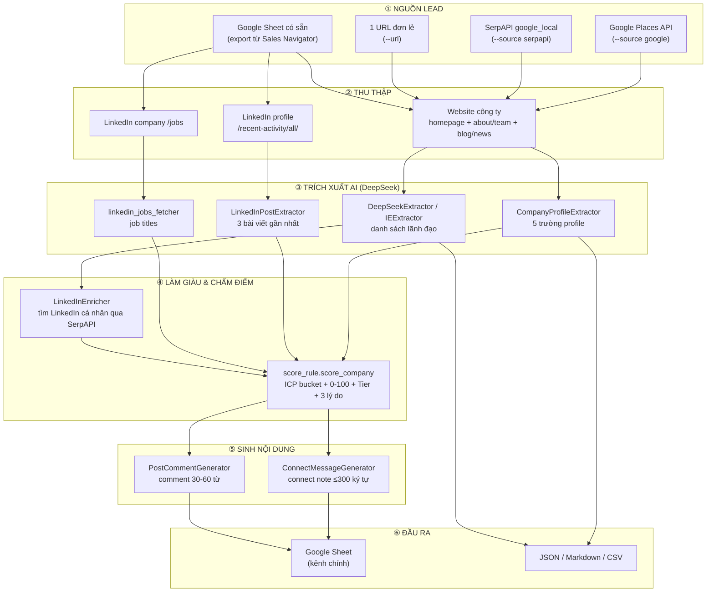
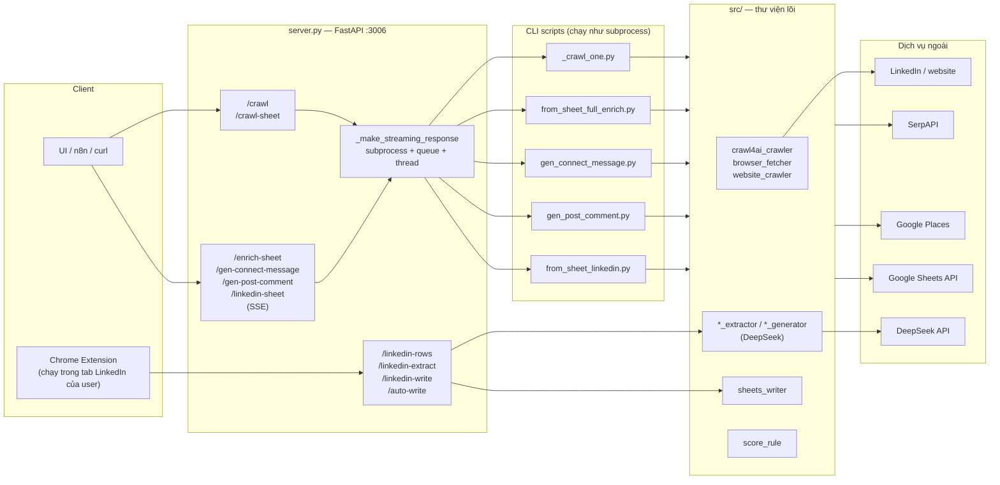
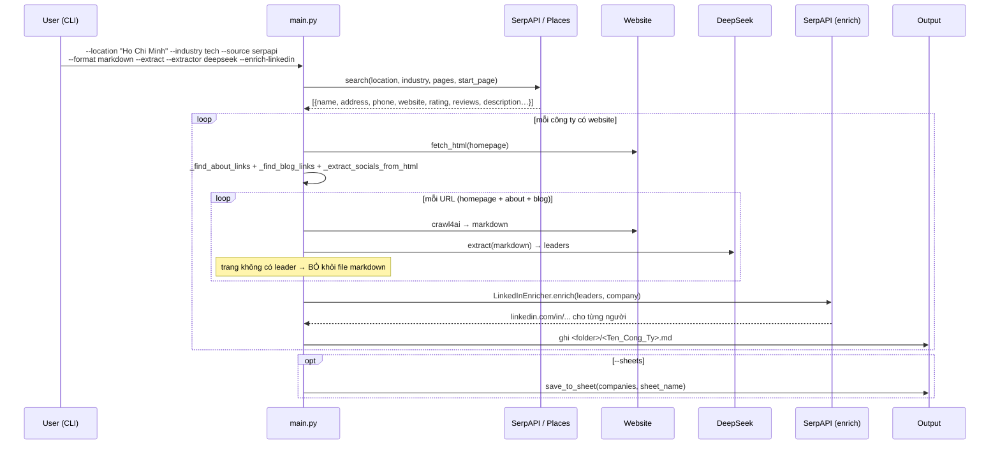
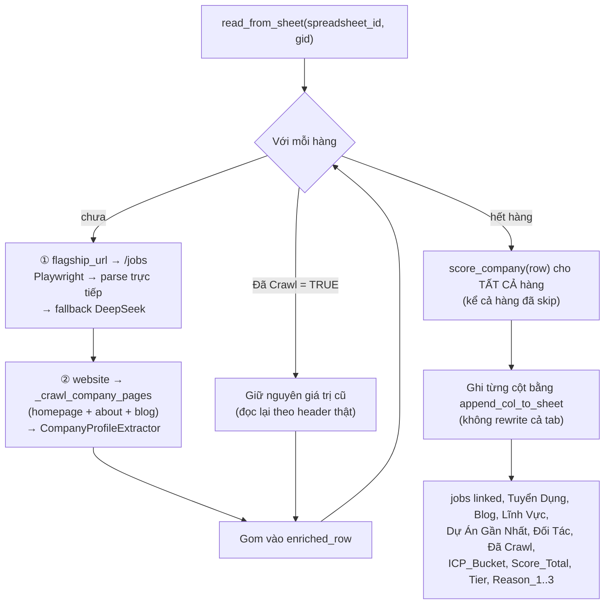
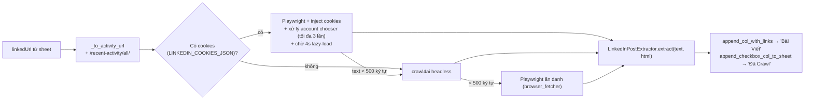
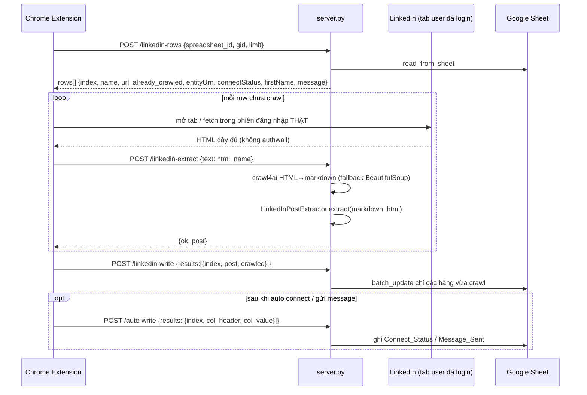
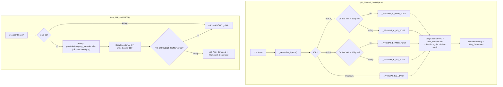

# SPECS — py-linked-crawl

**Hệ thống thu thập & làm giàu dữ liệu lead B2B (Company + LinkedIn) phục vụ outbound sales**

| | |
|---|---|
| **Tên repo** | `py-linked-crawl` |
| **Ngôn ngữ** | Python 3.10+ (một số type hint `X \| None` yêu cầu 3.10; f-string/`TypedDict` dùng 3.11 an toàn hơn) |
| **Hình thái** | CLI scripts + FastAPI HTTP service (+ Chrome extension phía client) |
| **Nguồn dữ liệu** | Google Places API, SerpAPI, website công ty, LinkedIn (profile / company jobs) |
| **AI** | DeepSeek (`deepseek-chat` qua OpenAI-compatible SDK); tuỳ chọn Qwen2.5-3B + LoRA chạy local |
| **Lưu trữ kết quả** | Google Sheets (chính), JSON / Markdown / CSV (phụ) |
| **Tài liệu tham chiếu** | `README.md`, `LINKEDIN_COOKIES_GUIDE.md`, `CHANGELOG_LINKEDIN_CRAWL.md`, `docs/` |

---

## Mục lục

1. [Mục đích & bài toán](#1-mục-đích--bài-toán)
2. [Bức tranh tổng thể — pipeline lead generation](#2-bức-tranh-tổng-thể--pipeline-lead-generation)
3. [Kiến trúc hệ thống](#3-kiến-trúc-hệ-thống)
4. [Danh mục thành phần (module map)](#4-danh-mục-thành-phần-module-map)
5. [Đặc tả chi tiết từng module lõi (`src/`)](#5-đặc-tả-chi-tiết-từng-module-lõi-src)
6. [Các luồng nghiệp vụ end-to-end](#6-các-luồng-nghiệp-vụ-end-to-end)
7. [Đặc tả HTTP API (`server.py`)](#7-đặc-tả-http-api-serverpy)
8. [Đặc tả CLI](#8-đặc-tả-cli)
9. [Mô hình dữ liệu](#9-mô-hình-dữ-liệu)
10. [Hệ thống chấm điểm ICP (barem 100 điểm)](#10-hệ-thống-chấm-điểm-icp-barem-100-điểm)
11. [Prompt engineering — toàn bộ prompt DeepSeek](#11-prompt-engineering--toàn-bộ-prompt-deepseek)
12. [Cấu hình, xác thực & biến môi trường](#12-cấu-hình-xác-thực--biến-môi-trường)
13. [Chống chặn (anti-bot) & chuỗi fallback](#13-chống-chặn-anti-bot--chuỗi-fallback)
14. [Cơ chế idempotency / resume](#14-cơ-chế-idempotency--resume)
15. [Vận hành & triển khai](#15-vận-hành--triển-khai)
16. [Kiểm thử](#16-kiểm-thử)
17. [Hạn chế, rủi ro & bug đã phát hiện](#17-hạn-chế-rủi-ro--bug-đã-phát-hiện)
18. [Đề xuất cải tiến](#18-đề-xuất-cải-tiến)
19. [Phụ lục](#19-phụ-lục)

---

## 1. Mục đích & bài toán

### 1.1. Dự án này để làm gì?

`py-linked-crawl` là **dây chuyền tự động hoá khâu đầu của quy trình bán hàng B2B outbound**: từ chỗ chỉ có "địa điểm + ngành nghề" hoặc một danh sách công ty thô trong Google Sheet, hệ thống tự động:

1. **Tìm** công ty mục tiêu (Google Places / SerpAPI).
2. **Crawl** website công ty và trang LinkedIn của công ty/cá nhân.
3. **Trích xuất bằng AI** các tín hiệu mua hàng: đang tuyển ai, làm dự án gì, đối tác nào, lĩnh vực gì, ai là lãnh đạo, họ vừa đăng bài gì trên LinkedIn.
4. **Chấm điểm ICP** (Ideal Customer Profile) bằng rule-based, phân loại HOT / WARM / COLD / DROP.
5. **Sinh nội dung tiếp cận cá nhân hoá**: connection request message và comment để thả dưới bài viết LinkedIn của lead.
6. **Ghi ngược tất cả về Google Sheet** — nơi đội sales làm việc hằng ngày.

### 1.2. Vấn đề nó giải quyết

| Việc thủ công trước đây | Hệ thống thay thế bằng |
|---|---|
| SDR mở từng website công ty đọc trang About/Team/Careers | `_crawl_company_pages` + `CompanyProfileExtractor` |
| Tìm LinkedIn cá nhân của từng lãnh đạo bằng Google | `LinkedInEnricher` (SerpAPI `site:linkedin.com/in`) |
| Mở LinkedIn từng lead xem 3 bài gần nhất để có cớ bắt chuyện | `from_sheet_linkedin.py` + `LinkedInPostExtractor` |
| Đọc trang /jobs của công ty xem đang tuyển gì (tín hiệu ngân sách/tăng trưởng) | `linkedin_jobs_fetcher` |
| Tự chấm điểm lead trong đầu, không nhất quán | `src/score_rule.py` — barem 100 điểm, có lý do |
| Viết tay connect note & comment cho từng người | `ConnectMessageGenerator`, `PostCommentGenerator` |

### 1.3. Đối tượng khách hàng mục tiêu (ICP) mà hệ thống được tinh chỉnh cho

Định nghĩa nằm trong `src/score_rule.py` và `src/connect_message_generator.py`:

- **ICP-A — Enterprise End-user (AI Automation & DX)**
  Thị trường chính Singapore / Hong Kong, quy mô ≥ 250 nhân sự, ngành Finance / Banking / Insurance / Telco / E-commerce / Healthcare, là *end-user* (không phải agency/outsourcing), có tín hiệu AI/DX. Góc tiếp cận: khoảng cách giữa "làm được AI" và "AI sống sót qua governance/compliance".

- **ICP-B — Tech / Fintech / SaaS (Build AI Features & Data)**
  SG/HK, quy mô 100–1000, ngành Technology / Software / SaaS / Fintech / Platform, có tín hiệu AI mạnh và decision maker kỹ thuật. Góc tiếp cận: integration layer / data pipeline là chỗ team product mất thời gian nhất.

---

## 2. Bức tranh tổng thể — pipeline lead generation



### Ba "chế độ vận hành" tách biệt

| Chế độ | Điểm vào | Dùng khi |
|---|---|---|
| **CLI batch** | `main.py`, `from_sheet*.py`, `gen_*.py` | Chạy tay trên máy dev, có control đầy đủ, log ra terminal |
| **HTTP service** | `server.py` (uvicorn, port 3006) | Backend cho UI/n8n; endpoint dài chạy trả về **SSE stream** log realtime |
| **Browser-extension** | `/linkedin-rows` → extension → `/linkedin-extract` → `/linkedin-write` | Crawl LinkedIn **trong phiên đăng nhập thật của user** — cách né authwall bền nhất |

---

## 3. Kiến trúc hệ thống



### 3.1. Vì sao mọi thứ chạy qua subprocess?

`server.py:36-70` (`_crawl_url_sync`) và `server.py:234-286` (`_make_streaming_response`) đều spawn `sys.executable` chạy script con thay vì gọi hàm trực tiếp. Ba lý do:

1. **Playwright + asyncio trên Windows**: `crawl4ai` gọi `asyncio.run()` bên trong; nếu chạy trong event loop của FastAPI sẽ lỗi *"asyncio.run() cannot be called from a running event loop"*. Chạy process riêng → có event loop sạch, kèm `WindowsProactorEventLoopPolicy` (`server.py:9-10`, `_crawl_one.py:16-17`).
2. **Stream log realtime**: `stdout` của script con được đọc dòng-một-dòng, đẩy vào `queue.Queue`, generator async phát ra SSE `data: <line>`. Người dùng thấy tiến trình ngay thay vì chờ 10 phút.
3. **Cô lập lỗi**: script con crash không kéo sập server.

**Giao thức SSE nội bộ:**
- Mỗi dòng stdout → một event `data: <nội dung>\n\n`
- Kết thúc: `data: __EXIT__:<returncode>`
- Lỗi spawn: `data: __ERROR__:<message>` rồi `__EXIT__:1`
- Keepalive: nếu 20 giây không có dữ liệu → gửi comment `: keepalive` (chống AWS ALB cắt kết nối idle 60s — commit `ea52f02`)

---

## 4. Danh mục thành phần (module map)

### 4.1. Thư viện lõi — `src/`

| File | Vai trò | Phụ thuộc ngoài |
|---|---|---|
| `places_client.py` | Google Places Text Search + Details → danh sách công ty | `requests`, `tenacity` |
| `serp_client.py` | SerpAPI `google_local` → danh sách công ty (phân trang 20/trang) | `google-search-results` |
| `browser_fetcher.py` | `fetch_html(url)` — requests trước, tự fallback Playwright khi gặp Cloudflare/403 | `requests`, `playwright` |
| `crawl4ai_crawler.py` | `crawl_to_markdown(url, cookies)` — headless browser → markdown sạch (PruningContentFilter), stealth mode | `crawl4ai` |
| `website_crawler.py` | Regex/DOM heuristics: tìm link about/team, link blog/news, trích social + email + phone, trích lãnh đạo không dùng AI | `bs4`, `lxml` |
| `deepseek_extractor.py` | AI trích lãnh đạo → `[{name,title,linkedin,email}]` | `openai` → DeepSeek |
| `ie_extractor.py` | Bản local của trên: Qwen2.5-3B-Instruct + LoRA `alifabdulR/Qwen-2.5-3B-Information-Extraction2`, chạy CPU float32 | `transformers`, `peft`, `torch` **(không có trong requirements.txt)** |
| `company_profile_extractor.py` | AI trích 5 trường profile công ty từ markdown website | `openai` → DeepSeek |
| `linkedin_post_extractor.py` | Parse HTML LinkedIn lấy metadata post (activityId/url/type) + AI trích nội dung 3 bài gần nhất | `bs4`, `openai` |
| `linkedin_jobs_fetcher.py` | Playwright vào `/company/x/jobs` → parse trực tiếp (zero-token), fallback DeepSeek | `playwright`, `bs4`, `openai` |
| `linkedin_enricher.py` | Tìm URL LinkedIn cá nhân của lãnh đạo qua SerpAPI Google | `google-search-results` |
| `connect_message_generator.py` | Sinh LinkedIn connect note theo ICP-A/ICP-B/fallback | `openai` → DeepSeek |
| `post_comment_generator.py` | Sinh comment thả dưới bài viết LinkedIn | `openai` → DeepSeek |
| `score_rule.py` | Chấm điểm ICP rule-based 100 điểm, không tốn token | thuần Python |
| `sheets_writer.py` | Toàn bộ I/O Google Sheets: đọc, ghi cột, checkbox, hyperlink runs | `gspread`, `google-auth`, `google-auth-oauthlib` |
| `output_writer.py` | Ghi JSON / Markdown report ra đĩa | stdlib |

### 4.2. Điểm vào — root

| File | Loại | Mô tả ngắn |
|---|---|---|
| `main.py` | CLI | Pipeline gốc: search → crawl → (extract) → JSON/Markdown/Sheets |
| `server.py` | Service | FastAPI, 11 endpoint |
| `from_sheet.py` | CLI | Sheet → crawl website → 5 trường profile → ghi lại tab nguồn |
| `from_sheet_linkedin.py` | CLI | Sheet → crawl LinkedIn profile → 3 bài viết → cột `Bài Viết` + `Đã Crawl` |
| `from_sheet_linkedin_jobs.py` | CLI | Sheet → crawl LinkedIn `/jobs` → cột `jobs linked` |
| `from_sheet_full_enrich.py` | CLI | **Gộp 2 luồng** (jobs + website profile) + chấm điểm ICP, ghi 12+ cột |
| `gen_connect_message.py` | CLI | Sheet → DeepSeek → cột `connectMsg` |
| `gen_post_comment.py` | CLI | Sheet (cột `Bài Viết`) → DeepSeek → cột `Post_Comment` |
| `enrich_linkedin.py` | CLI | Làm giàu LinkedIn cá nhân cho các file JSON trong `response_deepseek/` |
| `analyze_companies.py` | CLI | Đọc file markdown công ty → DeepSeek phân tích sâu → CSV + JSON |
| `_crawl_one.py` | Helper | Crawl 1 URL trong process riêng, in JSON ra dòng cuối stdout |

### 4.3. Công cụ debug

| File | Mục đích |
|---|---|
| `get_linkedin_cookies.py` | Mở Chromium không headless → user login tay → dump `linkedin_cookies.json` |
| `test_extract_posts.py` | Nạp file HTML LinkedIn đã lưu → chạy `extract_posts_with_metadata()` → in chẩn đoán (phát hiện authwall, đếm `data-urn`…) |
| `save_html_for_debug.py` | Crawl 1 profile cố định, lưu HTML + markdown ra `/tmp` *(hardcode path Linux)* |
| `debug_crawl.py` | Soi heuristics tìm link about + lãnh đạo trên một website bất kỳ |

---

## 5. Đặc tả chi tiết từng module lõi (`src/`)

### 5.1. `browser_fetcher.fetch_html(url, timeout=10) -> str`

```
requests.get (UA Chrome 124)
  ├─ status != 403 và body không chứa "Just a moment..."  → trả HTML luôn
  └─ ngược lại (hoặc exception) → Playwright Chromium headless
        --disable-blink-features=AutomationControlled, --no-sandbox
        viewport 1280x800, locale en-US
        init script: xoá cờ navigator.webdriver
        goto(wait_until="domcontentloaded")
        wait_for_function: document.title !== 'Just a moment...'   (timeout = max(timeout*1000, 30_000))
        → page.content()
```

### 5.2. `crawl4ai_crawler.Crawl4AICrawler.crawl_to_markdown(url, cookies=None) -> str`

- Nếu `cookies=None` → tự đọc từ env `LINKEDIN_COOKIES_JSON` (đây là cách `server.py` bơm cookie xuống subprocess).
- `BrowserConfig(headless=True, enable_stealth=True, cookies=…)` — **cookies được nạp vào browser context**, không phải HTTP header.
- `DefaultMarkdownGenerator(content_filter=PruningContentFilter(), options={ignore_links: False, ignore_images: False})`.
- Trả `fit_markdown` (đã lọc nhiễu) → fallback `raw_markdown` → `""`.
- Bọc `asyncio.run()` trong try/except, lỗi trả `""` (không raise).
- Trên Windows tự bọc lại `sys.stdout/stderr` thành UTF-8 để tránh `charmap codec error`.

### 5.3. `website_crawler.WebsiteCrawler`

Heuristic thuần regex/DOM, **không tốn token** — dùng để (a) khám phá trang con, (b) lấy social/contact.

**Bộ regex:**

| Hằng số | Bắt gì |
|---|---|
| `ABOUT_HIGH_PRIORITY` | `about-us`, `ve-chung-toi`, `gioi-thieu`, `our story`, `who we are`, `về chúng tôi`, `giới thiệu` |
| `ABOUT_LOW_PRIORITY` | `about`, `team`, `leadership`, `management`, `people`, `đội ngũ`, `ban lãnh đạo` |
| `BLOG_PATTERNS` | `blog`, `news`, `insights`, `resources`, `press`, `tin-tuc`, `bài viết`, `articles`, `newsroom`… (lấy tối đa **3** link) |
| `SOCIAL_PATTERNS` | 11 nền tảng: linkedin, facebook, instagram, twitter/x, youtube, whatsapp, wechat, telegram, line, tiktok, zalo (đã loại `sharer`, `intent`, `share`) |
| `LEADERSHIP_KEYWORDS` | ceo/coo/cto/cfo/founder/president/director/chief …/giám đốc/tổng giám đốc/chủ tịch |

**`_find_nearby_name(element)`** — 4 chiến lược tìm tên người đứng cạnh chức danh, theo thứ tự:
1. Sibling `h1..h4` phía trước.
2. Phần text của parent đứng **trước** text chức danh.
3. Duyệt tất cả previous-siblings của parent.
4. Duyệt previous-siblings của grandparent.

**`_looks_like_name(text)`**: ≤60 ký tự, 2–5 từ, mọi từ viết hoa chữ đầu.

> Đây là extractor "rẻ" mặc định trong `run_json_mode`. Chất lượng thấp hơn AI nhiều — dùng `--extract --extractor deepseek` khi cần độ chính xác.

### 5.4. `linkedin_post_extractor` — phần khó nhất của hệ thống

#### `extract_posts_with_metadata(html) -> list[dict]`

Trả `[{activityId, url, type, user_text, has_content}]`. **4 chiến lược thử lần lượt**, dừng ở chiến lược đầu tiên có kết quả:

| # | Chiến lược | Selector |
|---|---|---|
| 1 | Carousel widget trên profile page (**chính**) | `li[data-testid="carousel-child-container"]` → `a[href*="/feed/update/urn:li:"]` |
| 2 | Thuộc tính `data-urn` (bản LinkedIn cũ) | `[data-urn^="urn:li:activity:"]` |
| 3 | Quét link `/feed/update/` | `a[href*="/feed/update/urn:li:"]` |
| 4 | Quét HTML thô | regex `userGeneratedContentId[=:]\D*?(\d{18,20})` (tối đa 10) |

#### Phân loại `type` (chiến lược 1)

| Tín hiệu HTML | type | Ý nghĩa |
|---|---|---|
| có `componentkey^="feed-original-share-description_"` | **3** | Repost kèm suy nghĩ riêng của user |
| có text `reposted this` | **2** | Repost thuần |
| còn lại | **1** | Bài gốc của user |

Ghi chú quan trọng trong code: `feed-commentary_*` xuất hiện ở **cả** type 1 và type 2 → không thể dùng riêng nó để phân biệt.

Text lấy ra:
- type 3 → lấy từ `feed-commentary_*` (suy nghĩ của user, **không** lấy nội dung được reshare)
- type 1, 2 → `feed-commentary_*` hoặc `translatable-commentary`
- Trước khi lấy text: `decompose()` mọi `<button>` (bỏ nút "…more"), rồi strip đuôi `…more`.

#### `_parse_urn_from_componentkey(componentkey)`

Decode ID post ẩn trong attribute `componentkey`:

| Pattern | URN sinh ra |
|---|---|
| `userGeneratedContentId=(\d+)` | `urn:li:ugcPost:<id>` |
| `shareId=(\d+)` | `urn:li:share:<id>` |
| `activityId=(\d+)` | `urn:li:activity:<id>` |

URL post = `https://www.linkedin.com/feed/update/<urn>/`

#### `LinkedInPostExtractor.extract(text, html=None) -> {"post": str}`

```
clean_linkedin_content(text)     # xoá [...more](url), link signup/trk=, dòng trắng
  → truncate 30 000 ký tự
  → nếu có html: extract_posts_with_metadata(html) → dựng metadata_block (tối đa 10 dòng)
  → chọn prompt: _USER_TEMPLATE_WITH_META (khoá activityId/url/type từ HTML)
                 hoặc _USER_TEMPLATE_NO_META
  → DeepSeek chat, temperature=0, max_tokens=2048
  → _parse: regex greedy \{[\s\S]*\}, fallback ```json code block```
  → _format_posts_output → chuỗi bullet
```

**Định dạng chuỗi ghi vào ô `Bài Viết`** (`_format_posts_output`):

```
• [type:1(original)] [activityId: urn:li:ugcPost:7474857215565430784] [linkPost: https://www.linkedin.com/feed/update/urn:li:ugcPost:7474857215565430784/] 3mo: <nội dung đầy đủ>
• [type:3(repost+thought)] [activityId: ...] [linkPost: ...] 1mo: <suy nghĩ user> | Reshared: <trích bài gốc>
• [type:2(repost)] [activityId: ...] [linkPost: ...] 2mo: (Repost of John: ...)
```

URL trong chuỗi này sẽ được `sheets_writer._build_text_format_runs` biến thành **hyperlink xanh có gạch chân** trong ô Google Sheets.

### 5.5. `linkedin_jobs_fetcher`

```
_build_jobs_url(company_url)        # thêm hậu tố /jobs nếu chưa có
  → _fetch_with_playwright          # đợi selector .job-search-card / .base-search-card__title …
                                    # scroll 1/2 trang, chờ 2s để lazy-load
  → _extract_job_titles_from_html   # ★ parse trực tiếp — ZERO TOKEN, ưu tiên số 1
  → (nếu rỗng) _html_to_markdown (crawl4ai) → cắt 8000 ký tự → DeepSeek → {"jobs":[...]}
  → format_jobs → "• Title 1\n• Title 2"
```

Ngoài ra có `_resolve_linkedin_url()` (HEAD follow redirect, ID số → slug công ty) — hiện **được định nghĩa nhưng chưa được gọi** trong luồng chính.

### 5.6. `sheets_writer` — hạ tầng ghi Sheet

| Hàm | Hành vi | Có phá dữ liệu cũ? |
|---|---|---|
| `read_from_sheet(spreadsheet_id, sheet_name, gid)` | `get_all_records()` → `list[dict]`, hàng 1 là header | không |
| `append_col_to_sheet(rows, col_key, col_header, …)` | Tìm cột theo header, chưa có thì thêm cuối; ghi từ hàng 2; tự `resize` nếu vượt `col_count` | **chỉ đè đúng 1 cột** |
| `append_col_with_links(...)` | Như trên + `textFormatRuns` biến URL thành hyperlink xanh | chỉ 1 cột |
| `append_checkbox_col_to_sheet(...)` | Ghi TRUE/FALSE + `setDataValidation` kiểu `BOOLEAN` (checkbox UI) | chỉ 1 cột |
| `update_sheet_with_extra_cols(...)` | `sheet.clear()` rồi ghi lại **toàn bộ** tab | ⚠️ **ghi đè cả tab** |
| `update_sheet_with_cols(...)` | Bản generic của trên | ⚠️ **ghi đè cả tab** |
| `write_enriched_sheet(...)` | Ghi sang tab riêng (tạo mới nếu chưa có) | clear tab đích |
| `save_to_sheet(companies, …)` | Ghi theo `HEADERS` 23 cột: 1 hàng công ty + 1 hàng con cho mỗi lãnh đạo | append nếu header khớp, ngược lại clear |

**Xác thực** (`_get_client`), theo thứ tự ưu tiên:
1. `GOOGLE_SERVICE_ACCOUNT_JSON` trỏ tới file service-account tồn tại → dùng ngay (khuyến nghị cho server).
2. Ngược lại OAuth2: `GOOGLE_OAUTH_CLIENT_SECRET` (mặc định `client_secret.json`), cache token vào `token.json`; lần đầu **mở trình duyệt** (`run_local_server`) → không dùng được ở môi trường headless.

Scope: `https://www.googleapis.com/auth/spreadsheets`.
`SPREADSHEET_ID` mặc định hardcode `1PW5LnQyXjyl0h16ooufYNYjR1_eb8DgfnCEGLNjsf10` (`sheets_writer.py:35`) — chỉ dùng khi caller không truyền id.

---

## 6. Các luồng nghiệp vụ end-to-end

### Flow 1 — Khai phá công ty theo địa điểm + ngành (`main.py`)



**Đầu ra `--format markdown`**: thư mục `companies_<location>_<industry>_<YYYYmmdd_HHMMSS>/`, mỗi công ty một file `.md` gồm: tiêu đề, Website/Address/Phone/Rating/Description, mục `## Leadership`, mục `## Website Content` (các trang nối bằng `---`, mỗi trang có heading `### <url>`).

**Đầu ra `--format json`** (mặc định): `companies_<location>_<industry>_<timestamp>.json` với payload `{location, industry, crawled_at, total, companies[]}`.

> Lưu ý: chỉ nhánh `--format markdown` dùng crawl4ai + AI extractor. Nhánh JSON dùng `WebsiteCrawler.crawl()` (heuristic) — nhẹ hơn nhưng kém chính xác. `--extract` chỉ có tác dụng ở nhánh markdown và `--url`.

---

### Flow 2 — Làm giàu toàn diện từ Sheet (`from_sheet_full_enrich.py`) ⭐ luồng chủ lực



**Cột đọc vào**: `flagship_url` (`--col-linkedin`), `website` (`--col-website`), `tuyển d` (`--col-name`, chỉ để log), `Đã Crawl`.
**13 cột ghi ra**: `jobs linked` + 5 cột profile + `Đã Crawl` (checkbox) + 6 cột điểm.

---

### Flow 3 — Crawl bài viết LinkedIn (2 biến thể)

#### 3a. Server-side (`from_sheet_linkedin.py`)



Xử lý màn hình chọn tài khoản (`from_sheet_linkedin.py:166-229`): nếu URL chứa `login`/`checkpoint` hoặc title là "Choose an account", chạy JS thử click lần lượt `a[href*="sessionPassword"]`, `switchAccount`, item `<ul><li>` có `@`, cuối cùng là link đầu tiên trong form/account-picker. Không click được thì dump 15 link đầu ra log để debug.

#### 3b. Browser-extension (khuyến nghị — né authwall triệt để)



Ưu điểm: dùng phiên đăng nhập thật của user → không cần trích cookie, không bị stealth-detection, rate-limit theo hành vi người thật.

---

### Flow 4 — Sinh nội dung tiếp cận



**Quy tắc `_determine_icp`** (`connect_message_generator.py:127-147`):
1. Ưu tiên cột `ICP_Bucket` sẵn có (chứa `ICP-A`/`Enterprise AI` → A; `ICP-B`/`Tech AI` → B).
2. Fallback: ghép `industry` + `occupation` + `company_name` + `description` → so khớp `_ICP_A_KW` trước, rồi `_ICP_B_KW`.
3. Không khớp → `Unknown` → dùng prompt fallback chung.

---

### Flow 5 — Phân tích sâu file markdown (`analyze_companies.py`)

Đọc file `.md` do `save_markdown_report` sinh ra → tách theo heading `## ` → mỗi công ty cắt 6000 ký tự nội dung → DeepSeek trả JSON `{leadership[], contact{}, services[], summary}` → ghi:
- `response_deepseek/deepseek_<timestamp>.csv` (20 cột, **1 hàng / 1 lãnh đạo**, encoding `utf-8-sig` để Excel đọc tiếng Việt)
- `response_deepseek/deepseek_<timestamp>_result.json`
- In ra terminal dạng khung có phân mục Leadership / Contact / Social / Services.

---

## 7. Đặc tả HTTP API (`server.py`)

**Base**: `http://<host>:3006` · **CORS**: `allow_origins=["*"]`, mọi method/header · **Không có authentication**.

Khởi chạy: `python -m uvicorn server:app --port 3006 --reload`

### 7.1. Bảng tổng hợp

| Method | Path | Kiểu phản hồi | Chức năng |
|---|---|---|---|
| GET | `/health` | JSON | Health check |
| POST | `/crawl` | JSON | Crawl 1 URL + trích 5 trường profile |
| POST | `/crawl-sheet` | JSON | Crawl hàng loạt URL đọc từ Sheet |
| POST | `/enrich-sheet` | **SSE** | Chạy `from_sheet_full_enrich.py` |
| POST | `/gen-connect-message` | **SSE** | Chạy `gen_connect_message.py` |
| POST | `/gen-post-comment` | **SSE** | Chạy `gen_post_comment.py` |
| POST | `/linkedin-sheet` | **SSE** | Chạy `from_sheet_linkedin.py` (có truyền cookies) |
| POST | `/linkedin-rows` | JSON | Lấy danh sách hàng cho extension |
| POST | `/linkedin-extract` | JSON | HTML → markdown → trích 3 bài viết |
| POST | `/linkedin-write` | JSON | Ghi kết quả bài viết về Sheet |
| POST | `/auto-write` | JSON | Ghi cột trạng thái tuỳ ý về Sheet |

### 7.2. Chi tiết

#### `GET /health`
```json
{"status": "ok"}
```

#### `POST /crawl`
```jsonc
// Request
{"url": "https://example.com"}

// Response
{
  "ok": true,
  "url": "https://example.com",
  "markdown": "...",
  "tuyen_dung": "• Senior Backend Engineer\n• Product Manager",
  "blog": "• ...",
  "linh_vuc": "Fintech, Payment",
  "du_an_gan_nhat": "...",
  "doi_tac": "Vietcombank, VNPT"
}
```
Crawl chạy qua `_crawl_one.py` (subprocess, **timeout 60 giây**). Khi `ok=false` hoặc markdown rỗng, 5 trường profile vẫn có mặt nhưng bằng `""`.

#### `POST /crawl-sheet`
```jsonc
{"spreadsheet_id":"...", "gid":0, "sheet_name":null, "url_column":"website", "limit":10}
```
→ `{"ok":true, "total":N, "results":[{ok, url, markdown, row:{…dữ liệu gốc}}]}`
Lọc bỏ hàng không có URL **trước** khi áp `limit`. Yêu cầu `GOOGLE_SERVICE_ACCOUNT_JSON`. Không gọi DeepSeek.

#### `POST /enrich-sheet` · `/gen-connect-message` · `/gen-post-comment` · `/linkedin-sheet` — SSE

| Endpoint | Body | Script chạy |
|---|---|---|
| `/enrich-sheet` | `{spreadsheet_id, gid?, sheet_name?, limit?}` | `from_sheet_full_enrich.py` |
| `/gen-connect-message` | `{…, regen?: bool}` | `gen_connect_message.py` |
| `/gen-post-comment` | `{…, post_col?: "Bài Viết", regen?}` | `gen_post_comment.py` |
| `/linkedin-sheet` | `{…, col_linkedin?, col_name?, cookies?: [{name,value,domain,path}]}` | `from_sheet_linkedin.py` (cookies → env `LINKEDIN_COOKIES_JSON`) |

Ví dụ tiêu thụ:
```bash
curl -N -X POST http://localhost:3006/enrich-sheet \
  -H 'Content-Type: application/json' \
  -d '{"spreadsheet_id":"1G0A...","gid":1694881147,"limit":15}'

# data: Reading [gid=1694881147] from 1G0A... 
# data: Found 240 row(s).
# data: [1/15] ACME Corp
# : keepalive
# data: __EXIT__:0
```

#### `POST /linkedin-rows`
```jsonc
// Request
{"spreadsheet_id":"...", "gid":0, "limit":50,
 "col_linkedin":"linkedUrl", "col_name":"fullName", "col_message":"connectMsg"}

// Response
{"ok":true, "total":240, "rows":[
  {"index":0, "name":"John Doe", "url":"https://linkedin.com/in/johndoe",
   "already_crawled":false, "entityUrn":"urn:li:fs_salesProfile:(...)",
   "connectStatus":"", "firstName":"John", "message":"Hi John, ..."}
]}
```
`index` là **0-based theo thứ tự đọc**; hàng sheet tương ứng = `index + 2`.

#### `POST /linkedin-extract`
```jsonc
{"text":"<html>…</html>", "name":"John Doe"}   →   {"ok":true, "post":"• [type:1(original)] …"}
```
Điều kiện: `DEEPSEEK_API_KEY` phải có; `text` ≥ 200 ký tự; markdown sau chuyển đổi ≥ 100 ký tự — không đạt thì `{"ok":false, "post":"", "error":"..."}`.
Ghi file debug `/tmp/linkedin_debug_<name>.html|.md` (bọc try/except nên trên Windows chỉ im lặng bỏ qua).

#### `POST /linkedin-write`
```jsonc
{"spreadsheet_id":"...", "gid":0,
 "results":[{"index":0, "name":"John", "url":"...", "post":"• …", "crawled":true}]}
```
Chỉ đụng đúng những hàng gửi lên (tránh xoá trắng hàng cũ — commit `8c563b3`). Tự tạo cột `Bài Viết` / `Đã Crawl` nếu chưa có, tự `resize` sheet, áp `textFormatRuns` cho hyperlink và `BOOLEAN` validation cho checkbox. Trả `{"ok":true,"url":"<link sheet>"}`.

#### `POST /auto-write`
```jsonc
{"spreadsheet_id":"...", "gid":0,
 "results":[{"index":0, "col_header":"Connect_Status", "col_value":"pending"},
            {"index":1, "col_header":"Message_Sent",   "col_value":"TRUE"}]}
```
Gom theo `col_header` rồi `update_cells` từng nhóm. Dùng sau khi extension thực hiện auto-connect / auto-message.

---

## 8. Đặc tả CLI

### 8.1. `main.py`

```bash
python main.py [--url URL] [--location LOC] [--industry IND] [OPTIONS]
```

| Flag | Mặc định | Mô tả |
|---|---|---|
| `--url` | — | Crawl 1 URL, tự khám phá trang about/team, bỏ qua search |
| `--location` | *bắt buộc nếu không có `--url`* | Địa điểm |
| `--industry` | *bắt buộc nếu không có `--url`* | Ngành nghề |
| `--source` | `google` | `google` (Places) hoặc `serpapi` |
| `--format` | `json` | `json` hoặc `markdown` (markdown = dùng crawl4ai) |
| `--output-dir` | `.` | Thư mục lưu |
| `--no-crawl` | false | Chỉ lấy danh sách, bỏ crawl website (chỉ có tác dụng ở nhánh json) |
| `--pages` | `1` | Số trang SerpAPI (~20 kết quả/trang) |
| `--start-page` | `1` | Trang bắt đầu (`start = (start_page-1)*20`) |
| `--extract` | false | Bật trích lãnh đạo bằng model |
| `--extractor` | `qwen` | `qwen` (local) hoặc `deepseek` (API) |
| `--enrich-linkedin` | false | Tìm LinkedIn cá nhân qua SerpAPI |
| `--sheets` | false | Ghi kết quả lên Google Sheets |
| `--sheet-name` | `Sheet1` | Tên tab đích |

### 8.2. Các script đọc/ghi Sheet — bảng đối chiếu cột

| Script | Cột **đọc** | Cột **ghi** | Cột "đã xong" | Cách ghi |
|---|---|---|---|---|
| `from_sheet.py` | `website` (`--col-website`), `company_name` (`--col-name`) | `Tuyển Dụng`, `Blog`, `Lĩnh Vực`, `Dự Án Gần Nhất`, `Đối Tác` | ❌ không có | ⚠️ **clear + rewrite cả tab** |
| `from_sheet_linkedin.py` | `linkedUrl` (`--col-linkedin`), `fullName` (`--col-name`), `Đã Crawl` | `Bài Viết` (có hyperlink) | `Đã Crawl` (checkbox) | append từng cột |
| `from_sheet_linkedin_jobs.py` | `flagship_url` (`--col-linkedin`), `Đã Crawl` | `jobs linked` | `Đã Crawl` | append từng cột |
| `from_sheet_full_enrich.py` | `flagship_url`, `website`, `tuyển d`, `Đã Crawl` | `jobs linked`, 5 cột profile, `ICP_Bucket`, `Score_Total`, `Tier`, `Reason_1..3` | `Đã Crawl` | append từng cột |
| `gen_connect_message.py` | `firstName`/`fullName`, `job_title`, `company_name`, `country`/`location`, `occupation`, `Bài Viết`, `ICP_Bucket`, `Msg_Generated` | `connectMsg` | `Msg_Generated` | append từng cột |
| `gen_post_comment.py` | `Bài Viết` (`--post-col`), `job_title`, `company_name`, `location`/`country`, `Comment_Generated` | `Post_Comment` | `Comment_Generated` | append từng cột |

Flag chung của nhóm from_sheet/gen: `--spreadsheet-id` (bắt buộc), `--gid` **hoặc** `--sheet-name`, `--limit` (0 = tất cả), `--delay` (giây nghỉ giữa các hàng), `--regen` (chỉ nhóm `gen_*`, bỏ qua kiểm tra "đã xong").

### 8.3. Ví dụ lệnh hay dùng

```bash
# Khai phá + trích lãnh đạo + tìm LinkedIn cá nhân
python main.py --location "Ho Chi Minh" --industry "tech" --source serpapi \
  --format markdown --extract --extractor deepseek --enrich-linkedin

# Enrich toàn diện + chấm điểm ICP, thử 3 hàng đầu
python from_sheet_full_enrich.py --spreadsheet-id 1G0A... --gid 1694881147 --limit 3

# Crawl bài viết LinkedIn (cần cookies)
export LINKEDIN_COOKIES_JSON=$(cat linkedin_cookies.json)
python from_sheet_linkedin.py --spreadsheet-id 1nmy... --gid 0 --limit 3

# Sinh connect message, làm lại toàn bộ
python gen_connect_message.py --spreadsheet-id 1G0A... --gid 1694881147 --regen

# Sinh comment cho bài viết
python gen_post_comment.py --spreadsheet-id 1G0A... --gid 1694881147 --limit 20
```

---

## 9. Mô hình dữ liệu

### 9.1. `company` — đơn vị dữ liệu xuyên suốt pipeline

```jsonc
{
  "name": "ACME Technology",
  "address": "123 Nguyen Hue, District 1, HCMC",
  "phone": "+84 28 1234 5678",
  "website": "https://acme.tech",
  "rating": 4.5,                  // Places & SerpAPI
  "reviews": 128,                 // chỉ SerpAPI
  "description": "...",           // chỉ SerpAPI
  "place_id": "ChIJ...",
  "thumbnail": "https://...",     // chỉ SerpAPI
  "leaders": [ /* xem 9.2 */ ],   // thêm ở bước crawl
  "socials": { /* xem 9.3 */ },   // thêm ở bước crawl
  "markdown_content": "..."       // chỉ dùng cho save_markdown_report
}
```

> Hai client `PlacesClient` và `SerpClient` cố tình trả **cùng shape** để phần còn lại của pipeline không cần biết nguồn.

### 9.2. `leader`

| Nguồn | Trường có |
|---|---|
| `WebsiteCrawler` (heuristic) | `name`, `title` |
| `IEExtractor` (Qwen local) | `name`, `title` |
| `DeepSeekExtractor` | `name`, `title`, `linkedin`, `email` |
| Sau `LinkedInEnricher` | trường `linkedin` được điền nếu tìm được |

### 9.3. `socials`

```jsonc
{
  "email": "contact@acme.tech",           // từ href mailto: đầu tiên
  "phones": ["+8428...", "+8490..."],     // từ mọi href tel:
  "linkedin": "…", "facebook": "…", "instagram": "…", "twitter": "…",
  "youtube": "…", "whatsapp": "…", "wechat": "…", "telegram": "…",
  "line": "…", "tiktok": "…", "zalo": "…"  // mỗi nền tảng lấy URL ĐẦU TIÊN gặp
}
```

### 9.4. `post` (LinkedIn)

| Trường | Ý nghĩa |
|---|---|
| `activityId` | URN đầy đủ, vd `urn:li:ugcPost:7474857215565430784` |
| `url` | `https://www.linkedin.com/feed/update/<urn>/` |
| `type` | `1` bài gốc · `2` repost thuần · `3` repost + suy nghĩ |
| `date` | Chuỗi tương đối do DeepSeek đọc được (`3mo`, `1yr`…) |
| `content` | Nội dung đầy đủ, giữ nguyên ngôn ngữ gốc, đã bỏ số reaction/comment |

### 9.5. `HEADERS` của `save_to_sheet` (23 cột)

```
Company Name | Website | Address | Phone | Company Email | Company Phones |
LinkedIn (Co.) | Facebook | Instagram | Twitter | YouTube | WhatsApp | WeChat |
Telegram | Line | TikTok | Zalo | Services | Summary |
Person Title | Person Name | Person LinkedIn | Person Email
```
Bố cục: 1 hàng cho công ty (4 cột person để trống) + 1 hàng cho mỗi lãnh đạo (19 cột công ty để trống).

### 9.6. `CSV_FIELDNAMES` của `analyze_companies.py` (20 cột)

```
company_name, website, address, phone, rating, description,
person_name, person_title, person_linkedin, person_email, person_note,
company_emails, company_phones, linkedin_company, facebook, twitter, youtube,
other_socials, services, summary
```

---

## 10. Hệ thống chấm điểm ICP (barem 100 điểm)

Nguồn: `src/score_rule.py` · Hàm chính: `score_company(row) -> ScoreResult` · **Không tốn token.**

### 10.1. Tám hạng mục điểm

| Mã | Hạng mục | Trần | Quy tắc |
|---|---|---|---|
| **A** | Geography | 15 | SG/HK = 15 · US/CA/UK/EU-core/AU/NZ = 10 · EU còn lại = 5 · khác = 0. Lấy `max(country, city)` |
| **B** | Company Size | 15 | ≥1000 = 15 · 250–999 = 12 · 100–249 = 6 · <100 = 0 · thiếu dữ liệu = 0. Parse `employee_count`, fallback số đầu của `employee_range` |
| **C** | Industry | 15 | Ngành ICP-A = 15 · ICP-B (Tech/SaaS) = 12 · vendor/agency = 5 · ngành khác = 3 · không có = 0 |
| **D** | Company Type | 10 | End-user/product = 10 · agency/outsourcing = 3 · freelancer/marketplace = **0 (disqualifier)** · không có mô tả = 5 |
| **E** | AI/DX Signals | 15 | E1 mô tả/lĩnh vực (strong 8 / medium 4) + E2 blog·dự án·bài viết (4) + E3 tin tuyển AI/data (3), cap 15 |
| **F** | Service Fit | 10 | Doc/compliance ops (KYC, AML, claims, ERP…) = 10 · AI feature = 9 · data/ML pipeline = 8 · chung chung = 5 · không mô tả = 3 |
| **G** | Decision Maker | **20** | 6 bậc theo `job_title`/`occupation` — xem bảng dưới |
| **H** | Engagement | 5 | Premium account +2 · có bài viết (>20 ký tự) +3 |

**Bậc Decision Maker (G):**

| Điểm | Chức danh |
|---|---|
| 20 | CTO, CIO, Chief Technology/Information, VP Engineering, Head of Engineering |
| 18 | Head of Data / AI / Digital Transformation, Chief Data/AI, Director of Data/AI/Digital |
| 16 | Head of Product, Product Director, VP Product, Chief Product |
| 12 | COO, Chief Operating, Head of Operations, Operations Director |
| 10 | Engineering Manager, Product Owner, Program/Project Manager, Tech Lead · **và** Director/VP/Head chung chung |
| 8 | Procurement / Vendor Management · Senior / Manager / Lead |
| 5 | Không có title, hoặc title không nhận diện được |
| 2 | Business Development, HR, Recruiter, Marketing, Sales (phi kỹ thuật) |

### 10.2. Bonus / Penalty

| | Điều kiện | Giá trị |
|---|---|---|
| Bonus (trần **+5**) | Cột `Đối Tác` chứa đối tác enterprise/regulated (bank, insurance, telco, MAS, Microsoft, AWS, DBS, OCBC, Visa…) | +3 |
| | Cột `jobs linked` lộ chức danh C-level/Head/VP/Director | +2 |
| Penalty (trần **−10**) | Thiếu `industry`, hoặc thiếu cả `employee_count` lẫn `employee_range` | +5 |
| | Thiếu `description` | +5 |
| | Có từ khoá loại trừ (`freelancer`, `no budget`, `pre-product`…) | +5 |

### 10.3. Tổng hợp & phân loại

```
raw   = A + B + C + D + E + F + G + H          # trần lý thuyết 105
total = clamp(raw + bonus − penalty, 0, 100)
```

| Tier | Ngưỡng |
|---|---|
| **HOT** | ≥ 80 |
| **WARM** | 60–79 |
| **COLD** | 40–59 |
| **DROP** | < 40 |

### 10.4. Gán `ICP_Bucket`

| Bucket | Điều kiện (AND) |
|---|---|
| `Enterprise AI Automation (ICP-A)` | SG/HK **và** size ≥ 250 **và** ngành ICP-A **và** end-user (D ≥ 10) **và** E1 ≥ 8 |
| `Tech AI Product Delivery (ICP-B)` | SG/HK **và** 100 ≤ size ≤ 1000 **và** ngành ICP-B **và** E1 ≥ 8 **và** G ≥ 10 |
| `Enterprise AI Automation (ICP-A)` *(nới lỏng)* | **không** SG/HK **và** size ≥ 500 **và** ngành ICP-A **và** end-user **và** E1 ≥ 8 |
| `Not ICP` | còn lại |

### 10.5. `Reason_1..3`

Sắp 8 hạng mục theo điểm giảm dần, lấy ghi chú của 3 hạng mục cao nhất — cho sales biết **vì sao** lead này được điểm đó (ví dụ: `"Primary market: Singapore (SG/HK)"`, `"C/VP tech: chief technology officer"`).

---

## 11. Prompt engineering — toàn bộ prompt DeepSeek

Cấu hình chung: `model="deepseek-chat"`, `base_url="https://api.deepseek.com"`, gọi qua SDK `openai`.

| Module | Temp | max_tokens | Cắt input | Kiểu trả về |
|---|---|---|---|---|
| `DeepSeekExtractor` | 0 | 1024 | 30 000 ký tự | JSON array `[{name,title,linkedin,email}]` |
| `CompanyProfileExtractor` | 0 | 1024 | 30 000 ký tự | JSON object 5 key |
| `LinkedInPostExtractor` | 0 | 2048 | 30 000 ký tự | JSON `{"posts":[…]}` |
| `linkedin_jobs_fetcher` | 0 | 512 | 8 000 ký tự | JSON `{"jobs":[…]}` |
| `ConnectMessageGenerator` | **0.7** | 150 | bio 200 / post 300 | Chuỗi thuần |
| `PostCommentGenerator` | **0.7** | 150 | post 2 000 | Chuỗi thuần |
| `analyze_companies.py` | 0 | 2048 | 6 000 ký tự | JSON object 4 key |

### 11.1. `CompanyProfileExtractor` — 5 trường profile

Prompt tiếng Việt, yêu cầu **đúng 5 key**:

| Key | Yêu cầu |
|---|---|
| `tuyen_dung` | Danh sách vị trí đang tuyển, mỗi dòng `•`, **không lấy URL** |
| `blog` | Tóm tắt 3 bài gần nhất, mỗi dòng `•`, **giữ nguyên ngôn ngữ gốc, không dịch** |
| `linh_vuc` | Lĩnh vực chính, ngăn cách dấu phẩy (vd `"Fintech, Payment, B2B SaaS"`) |
| `du_an_gan_nhat` | Tên + mô tả ngắn dự án/sản phẩm mới nhất |
| `doi_tac` | Đối tác/khách hàng nổi bật, ngăn cách dấu phẩy |

Parse: regex `\{.*?\}` (DOTALL) → `json.loads` → chỉ nhận giá trị kiểu `str`. Lỗi → trả `_EMPTY` (5 key rỗng) — **không bao giờ raise**.

### 11.2. `LinkedInPostExtractor` — hai biến thể

**`_USER_TEMPLATE_WITH_META`** (có metadata từ HTML): đưa sẵn khối metadata dạng
`N. activityId=… | type=…(label) | url=… | preview: <100 ký tự đầu>`
và ra lệnh **copy chính xác** `activityId`/`url`, dùng `type` từ HTML (khớp bài bằng độ tương đồng preview). Yêu cầu:
- Lấy nội dung **đầy đủ**, không tóm tắt, không dịch.
- Xoá mọi số reaction/comment/share.
- type 2 → `"(Repost of [author]: [nội dung gốc])"`.
- type 3 → `"[suy nghĩ user] | Reshared: [trích bài gốc]"`.

**`_USER_TEMPLATE_NO_META`**: tự phân loại type, `activityId`/`url` để rỗng.

### 11.3. `ConnectMessageGenerator` — 5 prompt

System: *"…Messages must be concise (under 300 characters), natural, and never sound like a sales pitch. Return ONLY the message text."*

| Prompt | Khung mẫu (rút gọn) |
|---|---|
| `_PROMPT_A_WITH_POST` | *"Hi [Name], your point on [chủ đề DX/automation/compliance từ bài viết] resonates — we see the same execution gap in SG/HK enterprises. Integrating AI workflows that survive governance is harder than the model…"* |
| `_PROMPT_A_NO_POST` | *"Hi [Name], I noticed [Company] is pushing on [mảng DX/AI theo ngành] — the integration and governance layer is where most SG/HK enterprise teams lose weeks…"* |
| `_PROMPT_B_WITH_POST` | *"Hi [Name], your take on [chủ đề AI/data pipeline từ bài viết] is spot on — the integration layer is where most teams lose time…"* |
| `_PROMPT_B_NO_POST` | *"Hi [Name], I noticed [Company] is building out [năng lực AI/data theo profile] — the integration layer is where most product teams lose time…"* |
| `_PROMPT_FALLBACK` | Cá nhân hoá theo tên/vai trò/công ty, kết bằng CTA nhẹ |

Hậu xử lý: nếu chuỗi trả về bọc trong `"…"` thì bóc dấu ngoặc kép.

### 11.4. `PostCommentGenerator` — prompt dài & chặt nhất hệ thống

Persona: *senior Business Development Executive 10+ năm kinh nghiệm*. Đầy đủ nội dung được chép nguyên trong `docs/prompt_post_comment.md`. Điểm cốt lõi:

- **Quy trình suy luận nội bộ 6 bước** (không xuất ra): tìm chi tiết cụ thể nhất → suy ra domain → vì sao đáng quan tâm → hiệu chỉnh theo role → cân nhắc yếu tố vùng miền → hình thành một câu hỏi tò mò thật lòng.
- **ROLE CALIBRATION**: CEO/Founder → tầm nhìn & "why now"; CTO/VP Eng/Head of Product → kiến trúc & trade-off; BDM/Sales → tiếp nhận thị trường; Ops → thực tế vận hành.
- **Ràng buộc nghiêm ngặt**: cấm nhắc bất kỳ công ty/sản phẩm/dịch vụ nào (kể cả của mình); cấm nhắc tên/công ty/vị trí của lead; cấm xin call/meeting/connect; cấm sáo ngữ ("Great post", "Thanks for sharing", "Very insightful"); cấm tóm tắt lại bài; cấm emoji/hashtag/em-dash; cấm trích nguyên văn (phải paraphrase).
- **Đầu ra**: 2–3 câu, 30–60 từ, luôn bằng **tiếng Anh** kể cả khi bài viết là ngôn ngữ khác.
- **Edge case**: bài rỗng/không có nội dung đáng phản hồi → trả đúng chuỗi `NO_COMMENT_GENERATED`, generator quy về `""`.

---

## 12. Cấu hình, xác thực & biến môi trường

### 12.1. `.env`

```env
# Nguồn dữ liệu
GOOGLE_PLACES_API_KEY=...     # bắt buộc khi --source google
SERPAPI_KEY=...               # bắt buộc khi --source serpapi hoặc --enrich-linkedin

# AI
DEEPSEEK_API_KEY=sk-...       # bắt buộc cho gần như mọi luồng AI

# Google Sheets — chọn 1 trong 2
GOOGLE_SERVICE_ACCOUNT_JSON=path/to/service_account.json   # khuyến nghị (server/headless)
GOOGLE_OAUTH_CLIENT_SECRET=client_secret.json              # mặc định nếu không có SA

# Runtime (thường do server.py set, ít khi đặt tay)
LINKEDIN_COOKIES_JSON=[{"name":"li_at","value":"...","domain":".linkedin.com"}]
```

### 12.2. Ma trận "tính năng nào cần key nào"

| Tính năng | Places | SerpAPI | DeepSeek | Google Sheets | LinkedIn cookies |
|---|:--:|:--:|:--:|:--:|:--:|
| `main.py --source google` | ✅ | | | | |
| `main.py --source serpapi` | | ✅ | | | |
| `--extract --extractor deepseek` | | | ✅ | | |
| `--extract --extractor qwen` | | | | | *(cần `torch/transformers/peft`, không có trong requirements)* |
| `--enrich-linkedin` | | ✅ | | | |
| `--sheets` | | | | ✅ | |
| `from_sheet.py` / `from_sheet_full_enrich.py` | | | ✅ | ✅ | |
| `from_sheet_linkedin.py` | | | ✅ | ✅ | ✅ (gần như bắt buộc) |
| `from_sheet_linkedin_jobs.py` | | | ✅¹ | ✅ | |
| `gen_connect_message.py` / `gen_post_comment.py` | | | ✅ | ✅ | |
| `/crawl`, `/linkedin-extract` | | | ✅ | | |
| `/crawl-sheet`, `/linkedin-rows/write`, `/auto-write` | | | | ✅ (service account) | |

¹ Script bắt buộc phải có `DEEPSEEK_API_KEY` mới chạy, dù luồng chính "zero token" chỉ dùng DeepSeek khi parse trực tiếp thất bại.

### 12.3. Lấy LinkedIn cookies (3 cách — chi tiết ở `LINKEDIN_COOKIES_GUIDE.md`)

1. **Chrome extension** (EditThisCookie / Cookie-Editor) → export JSON → truyền vào body API `cookies`.
2. **DevTools thủ công**: Application → Cookies → `li_at` (**bắt buộc**), `JSESSIONID`, `li_a`.
3. **`python get_linkedin_cookies.py`**: mở Chromium, login tay, ENTER → lưu `linkedin_cookies.json`.

**Bảo mật**: `li_at` = toàn quyền tài khoản LinkedIn. Không commit, không chia sẻ. `.gitignore` đã chặn `*.json`. Cookie hết hạn sau ~1 tháng → crawl trả rỗng thì việc đầu tiên là export lại cookie mới.

### 12.4. Cài đặt

```bash
pip install -r requirements.txt
playwright install chromium          # bắt buộc — mọi luồng crawl đều cần
cp .env.example .env                 # rồi điền key
```

`requirements.txt`: requests, beautifulsoup4, tenacity, python-dotenv, lxml, google-search-results, playwright, crawl4ai, openai, gspread, google-auth, fastapi, uvicorn[standard], python-multipart.

> `google-auth-oauthlib` được `sheets_writer.py` import nhưng **không có trong `requirements.txt`** (thường được kéo theo gián tiếp). `torch/transformers/peft` cho `IEExtractor` đã bị gỡ khỏi requirements ở commit `a4b7231`.

---

## 13. Chống chặn (anti-bot) & chuỗi fallback

### 13.1. Bốn lớp kỹ thuật

| Lớp | Kỹ thuật | Nơi cài đặt |
|---|---|---|
| HTTP | User-Agent Chrome 124 thật | `browser_fetcher`, `linkedin_jobs_fetcher` |
| Browser | `--disable-blink-features=AutomationControlled`, `--no-sandbox` | `browser_fetcher`, `linkedin_jobs_fetcher`, `from_sheet_linkedin` |
| JS fingerprint | Xoá `navigator.webdriver`; giả `window.chrome`, `navigator.plugins`, `navigator.languages`, override `permissions.query` | `from_sheet_linkedin.py:144-159` |
| Framework | `crawl4ai` `enable_stealth=True` | `crawl4ai_crawler.py:50` |

### 13.2. Chuỗi fallback theo từng loại nguồn

**Website thường** — `fetch_html`:
```
requests  →  (403 hoặc "Just a moment...")  →  Playwright + chờ CF challenge qua
```

**LinkedIn profile** — `_crawl_linkedin`:
```
Playwright + cookies (authenticated)
   ↓ text < 500 ký tự
crawl4ai headless (stealth, có thể đọc cookie từ env)
   ↓ < 500 ký tự
Playwright ẩn danh (browser_fetcher)
   ↓ vẫn rỗng
trả ("", "") → ghi Bài Viết rỗng, Đã Crawl = FALSE (sẽ thử lại lần sau)
```

**LinkedIn company jobs** — `fetch_company_jobs`:
```
Playwright → parse selector trực tiếp (ZERO TOKEN)
   ↓ không tìm được title nào
crawl4ai markdown (8000 ký tự) → DeepSeek
```

**HTML → markdown** (`server._html_to_markdown`):
```
crawl4ai DefaultMarkdownGenerator + PruningContentFilter
   ↓ exception
BeautifulSoup get_text() gộp dòng
```

### 13.3. Rate limiting

| Nơi | Giá trị |
|---|---|
| `main.run_json_mode` | `time.sleep(0.5)` giữa các công ty |
| `from_sheet*.py` | `--delay`, mặc định 1.0–2.0 giây |
| `LinkedInEnricher` | hằng `DELAY = 1.5` giây giữa các truy vấn SerpAPI |
| `gen_*.py` | `--delay`, mặc định 1.0 giây |

---

## 14. Cơ chế idempotency / resume

Vì mỗi hàng tốn tiền (token DeepSeek, quota SerpAPI) và thời gian (crawl vài giây/hàng), mọi script batch đều có **cột đánh dấu hoàn thành** dạng checkbox:

| Script | Cột đánh dấu | Điều kiện skip | Cách bỏ qua skip |
|---|---|---|---|
| `from_sheet_linkedin.py` | `Đã Crawl` | `TRUE` (bool hoặc chuỗi) | xoá tick thủ công |
| `from_sheet_linkedin_jobs.py` | `Đã Crawl` | `TRUE` | xoá tick |
| `from_sheet_full_enrich.py` | `Đã Crawl` | `TRUE` | xoá tick |
| `gen_connect_message.py` | `Msg_Generated` | `TRUE` | `--regen` |
| `gen_post_comment.py` | `Comment_Generated` | `TRUE` | `--regen` |

**Nguyên tắc quan trọng khi skip** (bug từng gặp, sửa ở commit `8c563b3`): hàng bị skip vẫn phải được **đọc lại giá trị cũ theo tên header thật** rồi đưa vào `enriched_rows`, nếu không lần ghi tiếp theo sẽ ghi chuỗi rỗng đè lên dữ liệu cũ. Xem `from_sheet_full_enrich.py:159-161`.

Ngoài ra `append_col_to_sheet` / `append_col_with_links` ghi **theo cột chứ không rewrite cả tab**, nên việc thêm cột thủ công vào sheet không bị mất khi chạy lại. Riêng `from_sheet.py` (dùng `update_sheet_with_extra_cols`) thì **có** rewrite cả tab — cần cẩn thận.

---

## 15. Vận hành & triển khai

### 15.1. Chạy server

```bash
python -m uvicorn server:app --port 3006 --reload      # dev
python -m uvicorn server:app --host 0.0.0.0 --port 3006 # prod
```

### 15.2. Các điểm đặc thù môi trường

| Vấn đề | Xử lý trong code |
|---|---|
| Playwright cần ProactorEventLoop trên Windows | `asyncio.set_event_loop_policy(WindowsProactorEventLoopPolicy())` — `server.py:9-10`, `_crawl_one.py:16-17` |
| Console Windows lỗi `charmap codec` với tiếng Việt/emoji | `sys.stdout.reconfigure(encoding="utf-8")` ở đầu mọi script; `crawl4ai_crawler.py` bọc lại `TextIOWrapper` |
| Subprocess mất UTF-8 | Đặt `env["PYTHONIOENCODING"]="utf-8"` trước khi spawn |
| AWS ALB cắt kết nối SSE sau 60s idle | Keepalive `: keepalive` mỗi 20 giây (`server.py:270-277`) |
| Crawl treo | `/crawl` có `timeout=60` giây cho subprocess; các endpoint SSE **không có timeout** |
| Đường dẫn debug `/tmp/...` | Không tồn tại trên Windows — mọi chỗ ghi đều bọc `try/except` nên chỉ mất file debug |

### 15.3. Đặc điểm hiệu năng

- **Toàn bộ pipeline chạy tuần tự**, không có concurrency ở cấp hàng. Ước lượng: crawl website ~5–15s/công ty, LinkedIn profile ~10–20s/lead, cộng `--delay`.
- Mỗi lần crawl là **một lần khởi động browser mới** (`AsyncWebCrawler` context manager trong `_crawl`), không tái sử dụng browser giữa các URL → tốn ~1–2s overhead mỗi URL.
- Số lượt gọi DeepSeek trong `from_sheet_full_enrich`: tối đa 2 lần/công ty (jobs khi parse trực tiếp fail + profile).

---

## 16. Kiểm thử

Thư mục `tests/` (chạy bằng `pytest`):

| File | Phạm vi |
|---|---|
| `test_places_client.py` | Chuẩn hoá phản hồi Places, phân trang |
| `test_serp_client.py` | Chuẩn hoá phản hồi SerpAPI |
| `test_browser_fetcher.py` | Nhánh fallback Cloudflare |
| `test_website_crawler.py` | Regex about/blog/social, trích lãnh đạo heuristic |
| `test_company_profile_extractor.py` | Parse JSON 5 trường, xử lý lỗi |
| `test_output_writer.py` | Định dạng file JSON/Markdown |
| `test_sheets_writer_read_write.py` | Đọc/ghi sheet (mock gspread) |
| `test_from_sheet.py` | Orchestration của `from_sheet.py` |

**Chưa có test** cho: `linkedin_post_extractor` (module phức tạp nhất), `score_rule`, `connect_message_generator`, `post_comment_generator`, `linkedin_jobs_fetcher`, và toàn bộ `server.py`.

Công cụ kiểm thử thủ công: `test_extract_posts.py <file.html>` — chẩn đoán authwall, đếm phần tử `data-urn`, chạy thử `extract_posts_with_metadata()`.

---

## 17. Hạn chế, rủi ro & bug đã phát hiện

### 17.1. Bug chức năng

| # | Vị trí | Mô tả | Mức độ |
|---|---|---|---|
| B1 | `main.py:335` ↔ `src/places_client.py:13` | `main.py` gọi `client.search(location, industry, pages=…, start_page=…)` nhưng `PlacesClient.search()` chỉ nhận `(location, industry)` → **`TypeError` ngay lập tức**. Đây lại là `--source` **mặc định** (`google`) → luồng mặc định của `main.py` không chạy được. | 🔴 Cao |
| B2 | `main.py:135-154` | Trong `_crawl_company_pages`, nếu `fetch_html()` ném lỗi thì biến `html` không bao giờ được gán, nhưng dòng 154 vẫn đọc `... if html else {}` → **`NameError`**. | 🔴 Cao |
| B3 | `from_sheet_linkedin.py:109-111` | `headless=False` + `slow_mo=500` còn sót lại từ lúc debug → mở cửa sổ trình duyệt thật, chậm, và **không chạy được trên server không có display**. | 🟠 Trung bình |
| B4 | `from_sheet_linkedin_jobs.py:39` | Flag `--col-jobs` chỉ dùng để **đọc** giá trị cũ; lúc ghi luôn dùng hằng `JOBS_HEADER = "jobs linked"` → cấu hình của user bị bỏ qua (README ghi mặc định là `tuyển d`). | 🟡 Thấp |
| B5 | `from_sheet_full_enrich.py:71-73, 158` | `_is_done()` đọc header `"Đã Crawl"` nhưng log và README nói `"Đã Enrich"` → nếu sheet dùng tên cột theo tài liệu thì cơ chế skip **không hoạt động** (mọi hàng bị crawl lại). | 🟠 Trung bình |
| B6 | `src/linkedin_jobs_fetcher.py:126-131` | Gọi `generate_markdown(cleaned_html=…, html2text_options=…)`; ở `server.py:346-352` cùng API lại gọi bằng `input_html=…`. Một trong hai chữ ký sai với phiên bản crawl4ai đang dùng → rơi vào nhánh fallback BeautifulSoup âm thầm. | 🟡 Thấp |

### 17.2. Lệch giữa tài liệu và code

| Tài liệu nói | Code thực tế |
|---|---|
| `CHANGELOG_LINKEDIN_CRAWL.md` (v2.0.0): `/linkedin-extract` trả `{"posts": [...]}` mảng object | `server.py:404` trả `{"ok": true, "post": "<chuỗi bullet>"}` — **format cũ**. Client dựa vào changelog sẽ hỏng. |
| CHANGELOG mô tả type là chuỗi `"post"`/`"repost"`/`"repost_with_thought"` | Code dùng số `1`/`2`/`3` |
| CHANGELOG mô tả selector `feed-shared-update-v2__commentary`, `data-urn` | Code hiện dùng `data-testid="carousel-child-container"` + `componentkey` (LinkedIn đã đổi DOM) |
| `server.py:194` docstring: ghi cột `Connect_Message` | `gen_connect_message.py:23` ghi cột `connectMsg` |
| README: `from_sheet_full_enrich.py` ghi cột `Đã Enrich` | Code ghi `Đã Crawl` |
| README: `from_sheet.py` ghi vào tab `Enriched` (`--output-sheet`) | Code ghi đè **tab nguồn**, không có flag `--output-sheet` |

### 17.3. Rủi ro vận hành & bảo mật

| Rủi ro | Chi tiết | Giảm thiểu gợi ý |
|---|---|---|
| **API không xác thực** | `server.py` mở CORS `*`, không có auth. Ai gọi được endpoint là đọc/ghi được Google Sheet của bạn. | Thêm API key header / reverse proxy có auth / chỉ bind localhost |
| **Cookie LinkedIn trong body request** | `POST /linkedin-sheet` nhận `li_at` qua HTTP; nếu không có TLS thì lộ toàn quyền tài khoản | Bắt buộc HTTPS; cân nhắc chỉ dùng chế độ extension |
| **Cookie đi qua env var của subprocess** | `LINKEDIN_COOKIES_JSON` hiện trong environment của tiến trình con → có thể lộ qua `ps`/dump | Truyền qua stdin hoặc file tạm quyền 600 |
| **`update_sheet_with_extra_cols` clear cả tab** | Nếu người khác đang sửa sheet cùng lúc, dữ liệu của họ bị xoá | Chuyển `from_sheet.py` sang `append_col_to_sheet` |
| **ToS LinkedIn** | Crawl LinkedIn bằng cookie tài khoản thật có thể dẫn tới hạn chế/khoá tài khoản | Giữ delay cao, ưu tiên chế độ extension, giới hạn khối lượng/ngày |
| **`SPREADSHEET_ID` hardcode** | `sheets_writer.py:35` chứa ID sheet thật của một tổ chức | Đưa vào `.env` |
| **`.gitignore` có `*.json`** | Chặn được credentials, nhưng cũng vô tình chặn cả file JSON kết quả và fixture test | Thay bằng pattern hẹp hơn |
| **Không có retry cho DeepSeek** | Mọi extractor bắt exception rồi trả rỗng → lỗi mạng tạm thời làm mất dữ liệu hàng đó (nhưng vẫn tick "đã xong" ở một số script) | Thêm `tenacity` retry như `PlacesClient` đã làm |
| **Không có timeout cho endpoint SSE** | Job vài trăm hàng có thể chạy hàng giờ, không có cách hủy | Thêm giới hạn thời gian + endpoint cancel |

### 17.4. Hạn chế thiết kế

- **Tuần tự hoàn toàn**: không thể xử lý song song nhiều hàng → không hợp cho khối lượng hàng nghìn lead.
- **Không có tầng lưu trữ trung gian**: Google Sheet vừa là DB, vừa là hàng đợi, vừa là UI. Không có lịch sử phiên bản, không truy vấn được, giới hạn 10 triệu ô/spreadsheet.
- **Phụ thuộc DOM LinkedIn**: `extract_posts_with_metadata` bám vào `data-testid` và `componentkey` — LinkedIn đổi frontend là hỏng (đã xảy ra một lần, xem 17.2).
- **Trạng thái nhị phân**: cột "Đã Crawl" không phân biệt "crawl thành công" với "crawl xong nhưng rỗng" — muốn thử lại phải xoá tick thủ công.
- **Không có tracking chi phí**: không đếm token/số lần gọi API để ước lượng chi phí mỗi lần chạy.

---

## 18. Đề xuất cải tiến

**Ưu tiên 1 — sửa lỗi chặn luồng**
1. Thêm `pages`/`start_page` vào `PlacesClient.search()` (hoặc bỏ qua khi `source=google`) — sửa B1.
2. Khởi tạo `html = ""` trước `try` trong `_crawl_company_pages` — sửa B2.
3. Đặt `headless=True`, bỏ `slow_mo` trong `from_sheet_linkedin.py`; đưa ra flag `--headful` cho debug — sửa B3.
4. Thống nhất tên cột `Đã Crawl` / `Đã Enrich` giữa code, README và sheet thật — sửa B5.

**Ưu tiên 2 — nhất quán & tin cậy**
5. Đồng bộ `CHANGELOG_LINKEDIN_CRAWL.md` với hiện trạng, hoặc triển khai nốt format `posts[]` (kèm cờ tương thích ngược).
6. Gom mọi tên cột sheet vào một module hằng số duy nhất (`src/sheet_columns.py`) thay vì rải rác từng script.
7. Bọc `tenacity` retry (exponential backoff) cho mọi lời gọi DeepSeek; chỉ tick "đã xong" khi thực sự có dữ liệu.
8. Thêm test cho `score_rule` (bảng barem rất dễ viết test) và `linkedin_post_extractor` (dùng fixture HTML đã lưu).

**Ưu tiên 3 — mở rộng**
9. Thêm auth cho `server.py` (API key header) và siết `allow_origins`.
10. Xử lý song song có kiểm soát: `asyncio.Semaphore` hoặc thread pool giới hạn 3–5 hàng đồng thời; tái sử dụng một browser instance cho nhiều URL.
11. Thêm SQLite làm cache/hàng đợi trung gian, Google Sheet chỉ là view xuất ra → có lịch sử, retry chọn lọc, thống kê chi phí.
12. Ghi log có cấu trúc (JSON lines) thay vì `print`, để endpoint SSE có thể phát event có kiểu thay vì text thô.

---

## 19. Phụ lục

### 19.1. Từ điển cột Google Sheet

| Cột | Do script nào tạo | Kiểu | Nội dung |
|---|---|---|---|
| `linkedUrl` | *(dữ liệu đầu vào)* | text | URL LinkedIn cá nhân của lead |
| `flagship_url` | *(đầu vào)* | text | URL LinkedIn công ty (dùng để ghép `/jobs`) |
| `website` | *(đầu vào)* | text | Website công ty |
| `fullName`, `firstName`, `job_title`, `company_name`, `country`, `location`, `occupation`, `industry`, `employee_count`, `employee_range`, `description`, `premium`, `entityUrn`, `connectStatus` | *(đầu vào, thường export từ Sales Navigator)* | text | Trường lead chuẩn |
| `Bài Viết` | `from_sheet_linkedin.py`, `/linkedin-write` | text + hyperlink | 3 bài viết gần nhất, format `• [type:N(...)] [activityId: ...] [linkPost: ...] date: content` |
| `Đã Crawl` | nhiều script | checkbox | Đã xử lý hàng này chưa |
| `jobs linked` | `from_sheet_linkedin_jobs.py`, `from_sheet_full_enrich.py` | text | Danh sách job đang tuyển, mỗi dòng `•` |
| `Tuyển Dụng` | `from_sheet.py`, `from_sheet_full_enrich.py` | text | Vị trí tuyển từ **website** (khác `jobs linked` lấy từ LinkedIn) |
| `Blog` | như trên | text | Tóm tắt 3 bài viết/tin tức trên website |
| `Lĩnh Vực` | như trên | text | Lĩnh vực hoạt động |
| `Dự Án Gần Nhất` | như trên | text | Dự án/sản phẩm mới nhất |
| `Đối Tác` | như trên | text | Đối tác/khách hàng nổi bật |
| `ICP_Bucket` | `from_sheet_full_enrich.py` | text | `Enterprise AI Automation (ICP-A)` / `Tech AI Product Delivery (ICP-B)` / `Not ICP` |
| `Score_Total` | như trên | số | 0–100 |
| `Tier` | như trên | text | HOT / WARM / COLD / DROP |
| `Reason_1..3` | như trên | text | 3 hạng mục điểm cao nhất kèm giải thích |
| `connectMsg` | `gen_connect_message.py` | text | Connect note ≤300 ký tự |
| `Msg_Generated` | như trên | checkbox | |
| `Post_Comment` | `gen_post_comment.py` | text | Comment 30–60 từ |
| `Comment_Generated` | như trên | checkbox | |
| `Connect_Status`, `Message_Sent` | `/auto-write` (từ extension) | text | Trạng thái auto connect / gửi message |

### 19.2. Lịch sử tiến hoá (theo git log)

| Giai đoạn | Commit tiêu biểu | Nội dung |
|---|---|---|
| **1. CLI crawler cơ bản** | `9bb628b` → `28f1f8c` | Google Places + crawl website + heuristic tìm lãnh đạo |
| **2. Thêm nguồn SerpAPI** | `a71e29a` → `4fff1dc` | `--source` flag, hai client cùng interface |
| **3. Đưa AI vào** | `d7d7408` → `4f3a359` | DeepSeekExtractor, `analyze_companies.py`, xuất CSV/JSON |
| **4. Làm giàu LinkedIn** | `2b0c71b` → `97bd48a` | `LinkedInEnricher`, `enrich_linkedin.py`, đẩy lên Sheets |
| **5. Sheet là trung tâm** | `9ba52b0` → `06760dc` | `CompanyProfileExtractor`, `read_from_sheet`, `from_sheet.py` |
| **6. Service hoá** | `a1a4d8b`, `a4b7231` | FastAPI server, LinkedIn crawler, gỡ dependency ML nặng |
| **7. Chấm điểm & sinh nội dung** | `8c563b3` → `69daabf` | `score_rule.py`, connect message, auto-write, post comment, metadata post từ HTML |
| **8. Ổn định vận hành** | `ea52f02` | SSE keepalive chống AWS ALB timeout |

### 19.3. Kịch bản sử dụng mẫu (từ zero đến outbound)

```bash
# ── Bước 0: chuẩn bị ────────────────────────────────────────────────────────
pip install -r requirements.txt && playwright install chromium
cp .env.example .env       # điền DEEPSEEK_API_KEY, SERPAPI_KEY, GOOGLE_SERVICE_ACCOUNT_JSON

# ── Bước 1: khai phá danh sách công ty ──────────────────────────────────────
python main.py --location "Singapore" --industry "fintech" --source serpapi \
  --pages 3 --format markdown --extract --extractor deepseek --enrich-linkedin

# ── Bước 2: đổ danh sách lead vào Google Sheet ─────────────────────────────
#   (thủ công, hoặc export từ Sales Navigator với các cột ở 19.1)

# ── Bước 3: làm giàu công ty + chấm điểm ICP ───────────────────────────────
python from_sheet_full_enrich.py --spreadsheet-id <ID> --gid <GID>
#   → jobs linked, Tuyển Dụng, Blog, Lĩnh Vực, Dự Án Gần Nhất, Đối Tác,
#     ICP_Bucket, Score_Total, Tier, Reason_1..3

# ── Bước 4: lọc HOT/WARM rồi crawl bài viết LinkedIn ───────────────────────
export LINKEDIN_COOKIES_JSON=$(cat linkedin_cookies.json)
python from_sheet_linkedin.py --spreadsheet-id <ID> --gid <GID> --limit 50
#   → cột Bài Viết

# ── Bước 5: sinh nội dung tiếp cận ─────────────────────────────────────────
python gen_connect_message.py --spreadsheet-id <ID> --gid <GID>   # → connectMsg
python gen_post_comment.py    --spreadsheet-id <ID> --gid <GID>   # → Post_Comment

# ── Bước 6: sales dùng Chrome extension gửi connect / thả comment ─────────
#   extension gọi /linkedin-rows → thao tác trên LinkedIn → /auto-write
```

---

*Tài liệu này được sinh từ việc đọc toàn bộ mã nguồn tại commit `69daabf` (nhánh `master`). Mọi số hiệu dòng tham chiếu theo trạng thái repo tại thời điểm đó.*
